```python
# 사전 import
import os
import math

import numpy as np
from copy import copy
```

<div style="font-size: 2rem"> ML 문법</div>
<hr/>

[점프 투 파이썬]("https://wikidocs.net/book/1")   
<span style="color:orange; font-size:1.5rem;"><strong>강조</strong></span>  

# [주피터랩 단축키]
- a : 위 셀 집어넣기
- b : 아래 셀 집어넣기
- Ctrl +Shift + 위 : 셀 위로 이동
- Ctrl +Shift + 아래 : 셀 아래로 이동
- Shift + Enter : 셀 실행하며 아래 셀 생성
- Ctrl + Enter : 그냥 셀 실행.
- D 두번 : 셀 삭제. (실수 방지 목적으로 2번)
- x : 셀 잘라내기
- c : 셀 복사
- v : 셀 붙여넣기
- z : undo
- Shift + z : redo
- m : ML
- y : code

# 기초, 자료형 p45

## 숫자형

### 정수형


```python
a = 123
b = -123
c = 0
```


```python
print( a, b, c )
```

    123 -123 0


### 실수형


```python
aa = 1.23
bb = -3.1415
cc = 3.14e10
```


```python
print(aa, bb)
```

    1.23 -3.1415


### 8진수, 16진수 *
    8진수 0o17, 16진수 0x17


```python
a = 0o17
b = 0x17
print(a, b)
```

    15 23


### 숫자형을 활용하기 위한 연산자

#### 사칙연산


```python
a = 1234
b = 5678
print( a+b )
print( a-b )
print( a*b )
print( a/b )
print( a/3 )
print( a//3 )
print( a%3 )
print( a**2, b**3 )
```

    6912
    -4444
    7006652
    0.2173300457907714
    411.3333333333333
    411
    1
    1522756 183056925752


## 문자열 자료형 p50

### 문자열 만드는 법

#### 큰따옴표 양쪽 둘러싸기


```python
"Hello World~"
```


    'Hello World~'


#### 작은따옴표 양쪽 둘러싸기


```python
'wow~!'
```


    'wow~!'


#### 큰따옴표 3개 연속으로 쓰기


```python
"""
    Hello World~
    Nice too meet you~
"""
```


    '\n    Hello World~\n    Nice too meet you~\n'


#### 작은따옴표 3개를 연속으로 쓰기


```python
'''
    Thanks very much.
    Oh~! Nice Friend~
'''
```


    '\n    Thanks very much.\n    Oh~! Nice Friend~\n'


### 문자열 안에 작은 따옴표 or 큰 따옴표

#### 문자열에 작은따옴표 포함하기


```python
say = "He say 'Hello' so said."
print(say)
```

    He say 'Hello' so said.


#### 문자열에 큰따옴표 포함하기


```python
say = 'He say "Hello" so said.'
print(say)
```

    He say "Hello" so said.


#### 역슬래시로 이스케이프 문자 표현.


```python
say = "He say \"Hello\" so said."
print(say)
```

    He say "Hello" so said.


### 여러 줄인 문자열을 변수에 대입하고 싶을 때 (생략)

### 문자열 연산

#### 문자열 더하기


```python
a = 'Python is '
b = 'fun~'
print( a + b )
```

    Python is fun~


#### 문자열 곱하기


```python
aa = 'I\'m hungry!! '
print( aa * 3 )
```

    I'm hungry!! I'm hungry!! I'm hungry!! 


#### 문자열 곱하기(응용)


```python
print('=' * 50)
print('My Program'.center(50))
print('=' * 50)
```

    ==================================================
                        My Program                    
    ==================================================


- '문자열'.center(...) 로 중앙정렬 가능 추후 자세한 설명기회를..

#### 문자열 길이 구하기 *


```python
a = "Life is too short"
len(a)
```


    17


### 문자열 인덱싱, 슬라이싱 p56 **
#### 문자열 인덱싱

a = "Life is too short, You need Python"


```python
a = "Life is too short, You need Python"
```


```python
a[3]
```


    'e'


#### 문자열 인덱싱 활용하기
- 중요한 사항은 바로 아래에


```python
a1 = a[-3]
a2 = a[-1]
print( a1 + a2 )
```

    hn


```python
arr = [ a[0], a[12], a[-1] ]
```


```python
print( arr )
```

    ['L', 's', 'n']


```python
arr = [ a[-0], a[-2], a[-5] ]
```


```python
print( arr )
```

    ['L', 'o', 'y']


#### 문자열 슬라이싱


```python
a = "Life is too short, You need Python"
# b = a[0] + a[1] + a[2] + a[3] <<--- 귀찮...
b = a[0:4] # 이렇게 가능
print(b)
```

    Life


```python
b = a[-6:] # js의 for (let i=-6; i < 0; i++)
print(b)
```

    Python


#### 문자열을 슬라이싱 하는 방법


```python
a = "Life is too short, You need Python"
print(a[5:7])
print(a[19:])
print(a[:17])
print(a[:])
print(a[19:-7])
```

    is
    You need Python
    Life is too short
    Life is too short, You need Python
    You need


#### 슬라이싱으로 문자열나누기 (생략)

#### 슬라이싱과 대입 *


```python
a = "Pithon"
# a[1:2] = 'y' # 문자열은 낱개로 변경불가능한 자료형.
t = a[0] + 'y' + a[2:]
print( a, '>>', t )
```

    Pithon >> Python


<span style="color: orange; font-size: 1.2rem;">문자열은 낱개로 변경불가능한 자료형.</span>  
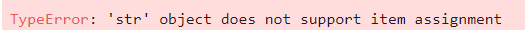

### 문자열 포메팅
  
<table style="float:left; font-size: 1.2rem;">
    <thead>
        <tr>
            <th>코드</th>
            <th>설명</th>
        </tr>
    </thead>
    <tbody>
        <tr>
            <td>%s</td>
            <td>문자열(String)</td>
        </tr>
        <tr>
            <td>%c</td>
            <td>문자 1개(character)</td>
        </tr>
        <tr>
            <td>%d</td>
            <td>정수(Integer)</td>
        </tr>
        <tr>
            <td>%f</td>
            <td>부동소수(floating-point)</td>
        </tr>
        <tr>
            <td>%o</td>
            <td>8진수</td>
        </tr>
        <tr>
            <td>%x</td>
            <td>16진수</td>
        </tr>
        <tr>
            <td>%%</td>
            <td>Literal % (문자 `%` 자체)</td>
        </tr>
    </tbody>
</table>

#### 숫자 바로 대입


```python
# import math << 반드시 집어넣기. 위에서 넣어서 생략.

print("I eat %d apples." % 3)
print("I eat %s apples." % "five")
print("%d >> octal >> %o, 1234 >> Hex >> %x" %(1234, 1234, 1234) )
print("%%f는 %f처럼 소숫점을 담을 수 있는데, 단순히 %%s는 %.8s처럼 문자열로 바꾸어 대입하기에 복잡하게 생각안해도 된다." %(math.pi, math.pi))
```

    I eat 3 apples.
    I eat five apples.
    1234 >> octal >> 2322, 1234 >> Hex >> 4d2
    %f는 3.141593처럼 소숫점을 담을 수 있는데, 단순히 %s는 3.141592처럼 문자열로 바꾸어 대입하기에 복잡하게 생각안해도 된다.


- '%.8s' 같은 정렬 및 표현에 관해서는 다음 코너에..

### 포맷코드와 숫자 함께 사용하기

#### 정렬과 공백
오른쪽 정렬

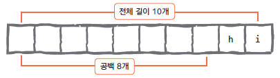  

왼쪽 정렬

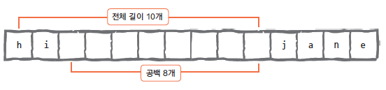


```python
print("%10s" % "hi")
```

            hi


```python
print("%-10sjane" % "hi")
```

    hi        jane


#### 소수점 표현하기

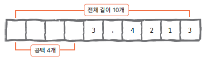


```python
# import math

print("%0.4f" %math.pi)
print("%10.4fmath pi" %math.pi)
print("%-10.4fpi" %math.pi)
```

    3.1416
        3.1416math pi
    3.1416    pi


### format 함수를 사용한 포매팅

#### 숫자바로대입하기


```python
a = "I eat {0}'s {1}EA apples".format(1004, 777)
print(a)
```

    I eat 1004's 777EA apples


#### 숫자 값을 가진 변수로 대입하기


```python
a = 1004
b = 777
c = "I eat {0}'s {1}EA apples".format(a, b)
print(c)
```

    I eat 1004's 777EA apples


#### 2개 이상의 값 넣기


```python
n = 10
day = "three"
"I ate {0} apples. so I was sick for {1} days.".format(n, day)
```


    'I ate 10 apples. so I was sick for three days.'


#### 이름으로 넣기


```python
"I ate {n} apples. so I was sick for {day} days.".format(n=10, day=3)
```


    'I ate 10 apples. so I was sick for 3 days.'


#### 인덱스와 이름을 혼용해서 넣기


```python
"I ate {0} apples. so I was sick for {day} days.".format(10, day=3)
```


    'I ate 10 apples. so I was sick for 3 days.'


#### 좌우 중앙 정렬


```python
"{0:<10}".format("hi") # 왼쪽

```


    'hi        '


```python
"{0:>10}".format("hi") # 오른쪽
```


    '        hi'


```python
"{0:^10}".format("hi") # 중앙
```


    '    hi    '


#### 공백 채우기


```python
"{0:=^10}".format("hi")
```


    '====hi===='


```python
"{0:!<10}".format("hi")
```


    'hi!!!!!!!!'


#### 소수점 표현


```python
a = 3.42134234
b = "{0:x>10.4f}".format(a)
```


```python
 "{0:0.4f}".format(a)
```


    '3.4213'


```python
print(b)
```

    xxxx3.4213


#### { 또는 } 문자 표현


```python
a = "{{ and }}".format()
b = '{ and }'
print(a, b)
```

    { and } { and }


### <strong>f 문자열 포매팅</strong>
- 3.6버전 이상만 가능


```python
n = 'nnn'
age = 30
dic = {'n': 'super', 'age': 1300}
print(f'이름은 {n}, 나이는 {age}\n')
print(f'이름은 {n}, 나이는 {age + 1}\n')
# dic = {n: 'super', age: 1300}
# print(f'이름은 {dic[n]}, 나이는 {dic[age]}\n') # 변수가 정의되지 않으면 못씀;;
print(f'이름은 {dic["n"]}, 나이는 {dic["age"]}\n')
print(f'{n:=^10}')
print(f'{"hi":=^10}')
# ========== 위에 한 내용이므로 생략 ==========
```

    이름은 nnn, 나이는 30
    
    이름은 nnn, 나이는 31
    
    이름은 super, 나이는 1300
    
    ===nnn====
    ====hi====


```python
# 생략이나.. 걍 진행.
a = math.pi
b = "{ and }"
c = f'{a:x>10.4f}'
d = f'{ b }'
print(c)
print(d)
```

    xxxx3.1416
    { and }


### 문자열 관련 함수들

#### 문자 개수 세기 - count


```python
a = 'coffee'
print('\'coffee\' is \'f\' count : ', a.count('f'))
```

    'coffee' is 'f' count :  2


```python
dir(a) 
dir(str) # 넘어가기..;;
```

#### 위치 알려 주기 1 - find
- 문자열만 사용가능


```python
 a = 'Milk Tea is the best choice in winter'
print(a.find('t'))
print(a.find('T'))
print(a.find('s'))
```

    12
    5
    10


```python
say = input()
if -1 != a.find(say):
    print('yes', a.find(say), 'st')
else:
    print('no!!')
```

     w


    yes 31 st


#### 위치 알려 주기 2 - index
- 문자열 이외에 리스트와 튜플 자료형에도 사용가능.
- 딕셔너리는 안됨;;


```python
a = 'Milk Tea is the best choice in winter'
print(a.index('b'))
# print(a.index('q')) # 없으면 에러.
```

    16


#### 문자열 삽입 - join *


```python
str = "abcdefg"
arr = ['apple', 'orange', 'kiwi', 'melon', 'pear', 'banana']
print(",".join(str))
print("-".join(arr))
```

    a,b,c,d,e,f,g
    apple-orange-kiwi-melon-pear-banana


#### 소문자 > 대문자, 대문자 > 소문자
- 소 > 대 : upper
- 대 > 소 : lower


```python
a = 'create'
a.upper()
```


    'CREATE'


```python
b = 'ALTER'
b.lower()
```


    'alter'


#### 공백제거
- 왼쪽 공백 > lstrip
- 오른쪽 공백 > rstrip
- 양쪽 공백 > strip *


```python
a = "{0:>10}".format("hi")
print(a.lstrip())
print(a.rstrip())
```

    hi
            hi


```python
b = "{0:<10}".format("hi")
print(b.lstrip())
print(b.rstrip())
```

    hi        
    hi


```python
c = "{0:^10}".format("hi")
print(c)
print(c.strip())
```

        hi    
    hi


```python
c = "{0:x^10}".format("hi")
print(c)
print(c.strip('x'))
```

    xxxxhixxxx
    hi


#### 문자열 바꾸기 - replace **


```python
a = "Life is too short"
print(a)
b = a.replace("Life", "Your stick")
print(b)
```

    Life is too short
    Your stick is too short


#### 문자열 나누기 - split **
- 문자열을 배열로
- 기준은 설정에 따라..


```python
print(b.split())
```

    ['Your', 'stick', 'is', 'too', 'short']


```python
path = os.getcwd()
parr = path.split('/')
print(parr)
```

    ['', 'home', 'pi01', 'py_test', 'py_data', 'Lec']


```python
# 이렇게 응용 가능.
s = 'Milk Tea is the best choice in winter'
n1 = s.replace(' ', '')
print(n1)
n2 = "*".join(n1)
print(n2)
n3 = n2.split('*')
print(n3)
```

    MilkTeaisthebestchoiceinwinter
    M*i*l*k*T*e*a*i*s*t*h*e*b*e*s*t*c*h*o*i*c*e*i*n*w*i*n*t*e*r
    ['M', 'i', 'l', 'k', 'T', 'e', 'a', 'i', 's', 't', 'h', 'e', 'b', 'e', 's', 't', 'c', 'h', 'o', 'i', 'c', 'e', 'i', 'n', 'w', 'i', 'n', 't', 'e', 'r']


## 리스트 자료형

### 리스트 표현


```python
odd = [1,3,5,7,9]
even = [2,4,6,8,10]
```

### 리스트의 인덱싱과 슬라이싱

#### 리스트의 인덱싱


```python
a=[1, 2, 3, ['a', 'b', 'c']]
print(a[0])
print(a[-1])
print(a[-1][1])
```

    1
    ['a', 'b', 'c']
    b


#### 리스트의 슬라이싱 *


```python
a = [1, 2, 3, 4, 5, 6, 7, 8, 9]
a
```


    [1, 2, 3, 4, 5, 6, 7, 8, 9]


```python
a = np.arange(10).tolist()
print(a[:])
print(a[:3])
print(a[3:])
```

    [0, 1, 2, 3, 4, 5, 6, 7, 8, 9]
    [0, 1, 2]
    [3, 4, 5, 6, 7, 8, 9]


```python
b=[1, 2, 3, ['a', 'b', 'c'], 4, 5]
print(b[-3])
print(b[2:5])
print(b[-3][:2])
```

    ['a', 'b', 'c']
    [3, ['a', 'b', 'c'], 4]
    ['a', 'b']


### 리스트 연산하기

#### 리스트 더하기(+)


```python
a = np.arange(1, 4).tolist()
b = np.arange(4, 7).tolist()
print(a + b)
```

    [1, 2, 3, 4, 5, 6]


#### 리스트 반복하기(*)


```python
print(a * 3) # [1, 2, 3] * 3
c = a * 5
print(c)
```

    [1, 2, 3, 1, 2, 3, 1, 2, 3]
    [1, 2, 3, 1, 2, 3, 1, 2, 3, 1, 2, 3, 1, 2, 3]


#### 리스트 길이 구하기


```python
a = np.arange(1, 8).tolist()
b = a * 13
print(len(a), len(b))
print(f'{a[3]}개')
print(str(a[3])+'개')
```

    7 91
    4개
    4개


### 리스트의 수정과 삭제

#### 리스트의 값 수정하기


```python
a = [1, 2, 3]
a[2] = 4
print(a)
```

    [1, 2, 4]


#### del 함수를 사용해 리스트 요소 삭제하기


```python
a = [1, 2, 3]
del(a[1])
print(a)
```

    [1, 3]


### 리스트 관련 함수 **

#### 요소 추가하기 - append


```python
a = np.arange(1, 4).tolist()
a.append(4)
print(a)
a.append([22, 11, 33])
print(a)
```

    [1, 2, 3, 4]
    [1, 2, 3, 4, [22, 11, 33]]


#### 리스트 정렬 - sort
- 얘는 타입이 한종류로만 들어가야함.
- 즉 타입이 모두 같은 배열이어야 기능이 작동함.


```python
a = [1, 3, 4, 2]
a.sort()
print(a)
```

    [1, 2, 3, 4]


#### 리스트 뒤집기 - reverse


```python
a.reverse()
print(a)
```

    [4, 3, 2, 1]


```python
# 만일 여러 난잡한 순의 숫자배열을 역순까지 정렬하려한다면..
# sort -> reverse -> print 이와 같은 순서로 진행하면됨.
a = [1, 5, 2, 10, 3, 0, 6]
a.sort()
a.reverse()
print(a)
```

    [10, 6, 5, 3, 2, 1, 0]


#### 인덱스 반환 - index
- 위 index와 마찬가지로 없으면 에러.


```python
print(a)
print(a.index(3))
print(a.index(1))
```

    [4, 3, 2, 1]
    1
    3


#### 리스트에 요소 삽입 - insert *


```python
a = [1, 2, 3]
a.insert(0, 4)
print(a)
```

    [4, 1, 2, 3]


```python
a.insert(3, 5)
print(a)
```

    [4, 1, 2, 5, 3]


```python
a.insert(-1, 'a')
print(a)
```

    [4, 1, 2, 5, 'a', 3]


#### 리스트 요소 제거 - remove


```python
a = np.arange(1, 4).tolist() * 2
a.remove(3)
print(a) # 첫번째 3만 제거.
```

    [1, 2, 1, 2, 3]


#### 리스트 요소 끄집어 내기 - pop
- pop(index) 이렇게 빼내는..


```python
a = [1, 2, 3]
a.pop()
a
```


    [1, 2]


```python
a = [1, 2, 3, 4]
a.pop(1)
print(a)
a.pop(-1) # == a.pop()
print(a)
a.pop()
print(a)
```

    [1, 3, 4]
    [1, 3]
    [1]


```python
a = np.arange(1, 6).tolist()
ch = int(input(f'{a}중에 제거할 숫자의 인덱스 입력.'))
if ch in a:
    b = a.pop(ch)
    print( f'{b}를 꺼내면 {a}가 됨.' )
else:
    print(f'{a}의 인덱스 범위내로 입력해주세요.')
```

    [1, 2, 3, 4, 5]중에 제거할 숫자의 인덱스 입력. 2


    3를 꺼내면 [1, 2, 4, 5]가 됨.


#### 리스트에 포함된 요소 x의 개수 세기 - count


```python
a = np.full(5, 1).tolist()
print(a.count(1))

```

    5


#### 리스트 확장 - extend
- extend([]) 이 (...) 안에 리스트만 들어갈 수 있음.


```python
a = [1, 2, 3]
b = [11, 3]
a.extend(b)
print(a)
```

    [1, 2, 3, 11, 3]


- 추후 리스트확장에서 문자+숫자 도전..(딱히..)


```python
a = [1,2,3,4,5]
# ...
```

## 튜플 자료형
- 간단하게 예시보여주기

#### 튜플형식


```python
t1 = ()
t2 = (1,) #*
t3 = (1, 2, 3)
t4 = 1,2,3 #*
t5 = ('a','b',('ab', 'cd'))

print(t1, t2, t3, t4, t5)
```

    () (1,) (1, 2, 3) (1, 2, 3) ('a', 'b', ('ab', 'cd'))


### 튜플 삭제나 변경은?

#### 튜플 요소값 삭제?


```python
t1 = (1,2,'a','b')
del t1[0]
```

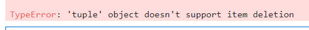

#### 튜플 요소값 변경?


```python
# t1값은 위 셀에..
t1[0] = 'c'
```

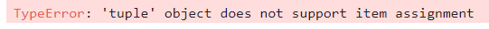

### 튜플 다루기

#### 인덱싱하기


```python
# t1 예시는 위에..
# 인덱싱 가능.
print(t1[0])
print(t1[3])
```

    1
    b


#### 슬라이싱 하기


```python
print(t1[1:])
```

    (2, 'a', 'b')


#### 튜플 더하기


```python
# t1...
t2 = (3, 4)
t3 = t1 + t2
print(t3)
```

    (1, 2, 'a', 'b', 3, 4)


#### 튜플 곱하기


```python
# t2..
t3 = t2 * 3
print(t3)
```

    (3, 4, 3, 4, 3, 4)


#### 튜플 길이구하기


```python
t3 = t1 + t2
print(len(t3))
```

    6


#### 1분코딩
- (1, 2, 3) 튜플에 4를 추가하기


```python
tt = (1, 2, 3)
tt = tt + (4, )
print(tt)
```

    (1, 2, 3, 4)


## 딕셔너리 자료형


```python
#여기서만 쓰일거 같아 여기서 import
import json
```

### 딕셔너리


```python
dic = {'name': 'hi', 'phone':'010-999-1234','birth':'1118'}
a = {0:'ok', 1:'hey'}
b = {'a':[1,2,3,4]}
print(a)
print(a[0])
print(dic)
print(dic['name'])
print(b)
print(b['a'])
print(type(b))
print(type(b['a']))
```

    {0: 'ok', 1: 'hey'}
    ok
    {'name': 'hi', 'phone': '010-999-1234', 'birth': '1118'}
    hi
    {'a': [1, 2, 3, 4]}
    [1, 2, 3, 4]
    <class 'dict'>
    <class 'list'>


```python
# 잠깐 json으로 변환예시..
js1 = json.dumps(dic)
print(js1)
```

    {"name": "hi", "phone": "010-999-1234", "birth": "1118"}


### 딕셔너리 쌍 수정하기(추가, 삭제)

#### 딕셔너리 쌍 추가하기


```python
a = {1:'a'}
a[2] = 'b'
a['name'] = 'pey'
a['arr'] = [1,2,3,4]
a
```


    {1: 'a', 2: 'b', 'name': 'pey', 'arr': [1, 2, 3, 4]}


#### 딕셔너리 요소 삭제하기


```python
aa = {1: 'a', 2: 'b', 'name': 'pey', 'arr': [1, 2, 3, 4]}
del aa['name']
print(aa)
```

    {1: 'a', 2: 'b', 'arr': [1, 2, 3, 4]}


#### 딕셔너리 사용방법


```python
dex1 = {"김연아": "피겨스케이팅", "류현진": "야구", "손흥민": "축구", "귀도": "파이썬"}
dex1["귀도"]
```


    '파이썬'


#### 딕셔너리에서 key를 사용해 Value 얻기


```python
grade = {'pay':10, 'lane':99}
dic = {'name': 'hi', 'phone': '010-999-1234', 'birth': '1118'}
print(grade['pay'])
print(dic['name'])
print(dic['phone'])
print(dic['birth'])
```

    10
    hi
    010-999-1234
    1118


#### 딕셔너리 만들 때 주의할 사항
- 유일한 값은 말 그대로 중복되면 안됨
    - a={'1':'a', '1':'b'} : 이러면 키값 중복사용했기에 앞에 1:'a'가 무시됨.
- 키 값을 리스트로는 불가
    - a={[1,2]:'hi'} # 오류발생;;

### 딕셔너리 관련 함수

#### key 리스트 만들기 - keys *


```python
a = {'name': 'hi', 'phone': '010-999-1234', 'birth': '1118'}
print('1:', a.keys(), type(a.keys()))

list_keys = list(a.keys())
print('2:', list_keys, type(list_keys))

t_keys = tuple(list_keys)
print('3:', t_keys, type(t_keys))
```

    1: dict_keys(['name', 'phone', 'birth']) <class 'dict_keys'>
    2: ['name', 'phone', 'birth'] <class 'list'>
    3: ('name', 'phone', 'birth') <class 'tuple'>


```python
'''
    dict_keys 객체는 리스트를 사용하는 것과 별 차이는 없지만, 리스트 고유의...
    append, insert, pop, remove, sort 함수는 실행할 수 없다.
'''
for k in a.keys():
    print(k)
```

    name
    phone
    birth


#### Value 리스트 만들기 - values(dict_values) *


```python
a = {(1,2,3): 'pay', 'phone': '010-999-1234', 'birth': '1118'}
print('1:', a.values(), type(a.values()))

list_values = list(a.values())
print('2:', list_values, type(list_values))

t_values = tuple(list_values)
print('3:', t_values, type(t_values))
```

    1: dict_values(['pay', '010-999-1234', '1118']) <class 'dict_values'>
    2: ['pay', '010-999-1234', '1118'] <class 'list'>
    3: ('pay', '010-999-1234', '1118') <class 'tuple'>


#### key, value 쌍 얻기 - items


```python
a = {(1,2,3): 'pay', 'phone': '010-999-1234', 'birth': '1118'}
print('1:', a.items(), type(a.items()))

list_items = list(a.items())
print('2:', list_items, type(list_items))

t_items = tuple(list_items)
print('3:', t_items, type(t_items))
```

    1: dict_items([((1, 2, 3), 'pay'), ('phone', '010-999-1234'), ('birth', '1118')]) <class 'dict_items'>
    2: [((1, 2, 3), 'pay'), ('phone', '010-999-1234'), ('birth', '1118')] <class 'list'>
    3: (((1, 2, 3), 'pay'), ('phone', '010-999-1234'), ('birth', '1118')) <class 'tuple'>


#### Key:Value 쌍 모두 지우기 - clear *


```python
b = a.copy()
a.clear()
print(a)
print('전 : ', b)
b.clear()
print('후 : ', b)
```

    {}
    전 :  {(1, 2, 3): 'pay', 'phone': '010-999-1234', 'birth': '1118'}
    후 :  {}


#### Key로 Value 얻기 - get


```python
a = {(1,2,3): 'pay', 'phone': '010-999-1234', 'birth': '1118'}
# print(a['hi']) # error
print(a.get('hi')) # 없을경우 None 반환.

if None is a.get('hi') :
    print('Not have ele..')
```

    None
    Not have ele..


```python
key = input('찾고자 하는 키 입력.')
if a.get(key):
    print(f'찾고자 하는 키의 값은 {a[key]} 입니다.')
else:
    print('찾고자 하는 키는 없습니다.')
```

    찾고자 하는 키 입력. phone


    찾고자 하는 키의 값은 010-999-1234 입니다.


- 살짝 응용해보자


```python
# 이렇게도 가능..
key = input('찾고자 하는 키 입력.')
nokey = 'code77'
if nokey is not a.get(key, nokey):
    print(f'찾고자 하는 키의 값은 {a[key]} 입니다.')
else:
    print(nokey, '찾고자 하는 키는 없습니다.')
```

    찾고자 하는 키 입력. b3


    code77 찾고자 하는 키는 없습니다.


#### 해당 key가 딕셔너리 안에 있는지 조사하기 - in *


```python
# a = {(1,2,3): 'pay', 'phone': '010-999-1234', 'birth': '1118'}
print('name' in a)
print((1,2,3) in a)
print('hi' in a)
```

    False
    True
    False


## 집합 자료형 *

### 집합자료형 - set


```python
s1 = set([5, 1, 2, 3, 3, 2, 1, 4])
s2 = set('Coffee')
print(s1)
print(s2)
```

    {1, 2, 3, 4, 5}
    {'e', 'o', 'C', 'f'}


- 자동 유니크 단일화, sort...
- 문자열도..

### 집합자료형 특징
- 중복을 허용안함.
- 순서가 없다.(unordered)
- 필터로 사용가능.
- 리스트나 튜플로 사용하면 요소에 접근가능


```python
s = [5, 1, 2, 3, 3, 2, 1, 4]
s1 = set(s)
l1 = list(s1)
t1 = tuple(s1)
print('origin: ', s)
print('set: ', s1)
print('to list: ', l1,'idx2 - ', l1[2])
print('to tuple: ', t1,'idx2 - ', t1[2])
```

    origin:  [5, 1, 2, 3, 3, 2, 1, 4]
    set:  {1, 2, 3, 4, 5}
    to list:  [1, 2, 3, 4, 5] idx2 -  3
    to tuple:  (1, 2, 3, 4, 5) idx2 -  3


### 교집합, 합집합, 차집합 구하기


```python
s1 = set([1, 2, 3, 4, 5, 6])
s2 = set([4, 5, 6, 7, 8, 9])
```

#### 교집합 구하기


```python
s3 = s1 & s2
print(s3, type(s3))
```

    {4, 5, 6} <class 'set'>


```python
s3 = s1.intersection(s2)
print(s3)
```

    {4, 5, 6}


#### 합집합 구하기


```python
s4 = s1 | s2
print(s4, type(s4))
```

    {1, 2, 3, 4, 5, 6, 7, 8, 9} <class 'set'>


```python
s4 = s1.union(s2) # 위와 같음.
print(s4)
```

    {1, 2, 3, 4, 5, 6, 7, 8, 9}


#### 차집합 구하기


```python
s5 = s1 - s2
s6 = s2 - s1
print(s5)
print(s6)
```

    {1, 2, 3}
    {8, 9, 7}


```python
# 위와 같음.
s5 = s1.difference(s2)
s6 = s2.difference(s1)
print(s5)
print(s6)
```

    {1, 2, 3}
    {8, 9, 7}


- 그냥 여기서 intersection, union, difference 등은 그냥 참고용..

### 집합자료형 관련 함수

#### 값 1개 추가하기 - add


```python
s1 = set([1, 2, 3])
s1.add(4)
print(s1)
```

    {1, 2, 3, 4}


#### 값 여러 개 추가하기 - update


```python
s1 = set([1, 2, 3])
s1.update([4, 5, 6])
print(s1)
```

    {1, 2, 3, 4, 5, 6}


#### 특정 값 제거하기 - remove


```python
s1 = set([1, 2, 3])
s1.remove(2)
print(s1)
```

    {1, 3}


## 불 자료형 *

### 불 자료형 (True, False)


```python
b1 = (1 == 1)
b2 = (2 > 1)
b3 = (2 < 1)
b4 = bool(())
b5 = bool([])
b6 = bool({})

print(b1, type(b1))
print(b2, type(b2))
print(b3, type(b3))
print(b4, type(b4))
print(b5, type(b5))
print(b6, type(b6))
```

    True <class 'bool'>
    True <class 'bool'>
    False <class 'bool'>
    False <class 'bool'>
    False <class 'bool'>
    False <class 'bool'>


### 자료형의 참, 거짓


```python
a = [1, 2, 3, 4, 5]
while a:
    print(a, a.pop())
```

    [1, 2, 3, 4] 5
    [1, 2, 3] 4
    [1, 2] 3
    [1] 2
    [] 1


### 불 연산


```python
b1 = bool([1, 2, 3])
b2 = bool([])
b3 = bool(0)
b4 = bool(3)
print(f'bool([1, 2, 3]):{b1}')
print('bool([]):%s' %(b2)) # 이런 표현법도 있는...
print(f'bool(0):{b3}')
print(f'bool(3):{b4}')
```

    bool([1, 2, 3]):True
    bool([]):False
    bool(0):False
    bool(3):True


## 자료형의 값을 저장하는 공간, 변수

### 변수 variable
- 변수 이름 - 변수에 저장할 값의 그릇이름?

### 변수란 무엇인가?


```python
a = [1, 2, 3]
b = [1, 2, 3]
c = a
d = a[:]
print(id(a))
print(id(b))
print(id(c))
print(a is c)
print(id(d))

c[1] = 4
print(a)
print(c)
```

    4037859272
    4037860360
    4037859272
    True
    4047852904
    [1, 4, 3]
    [1, 4, 3]


```python
# 변수는 복사보단 늘 가리키기에 같은 주소..
a = 3
b = 3
c = a
print(id(a))
print(id(b))
print(id(c))
```

    5655360
    5655360
    5655360


```python
# 문자열은?
a = 'sample'
b = 'sample'
c = a
d = a[:]

print(id(a))
print(id(b))
print(id(c))
print(id(d))
```

    4148043456
    4148043456
    4148043456
    4148043456


- 결론.. 이러한 id의 예시로는 리스트등 자료나열형 및 객체 애들한정으로 가능함을 보임.

### 리스트 복사

#### [:] 이용


```python
a = [1, 2, 3]
b = [1, 2, 3]
c = a
d = a[:]
print(id(a), a)
print(id(b), b)
print(id(c), c)
print(a is c)
print(id(d), d)
```

    4047852936 [1, 2, 3]
    4047854984 [1, 2, 3]
    4047852936 [1, 2, 3]
    True
    4048367848 [1, 2, 3]


#### copy() 이용


```python
a = [1, 2, 3]
b = [1, 2, 3]
c = a
d = a.copy()
print(id(a), a)
print(id(b), b)
print(id(c), c)
print(a is c)
print(id(d), d)
```

    4047853864 [1, 2, 3]
    4047835176 [1, 2, 3]
    4047853864 [1, 2, 3]
    True
    4048307432 [1, 2, 3]


```python
# from copy import copy # 이런방법도 있음.
a = [1, 2, 3]
b = copy(a)
print(b)
print(id(a))
print(id(b))
```

    [1, 2, 3]
    4048457512
    4048500776


```python
# [:] 이걸 쓰면 같은데.. import copy로 하면..

s1 = "hello"
s2 = s1[:]
print(id(s1))
print(id(s2))

s2 = copy(s1)
print(id(s1))
print(id(s2))
```

    4119243520
    4119243520
    4119243520
    4119243520


```python
a = {(1,2,3): 'pay', 'phone': '010-999-1234', 'birth': '1118'}
b = a.copy()
print("dictinary test")
print(id(a))
print(id(b))

a1 = (1, 2, 3)
b1 = copy(a1)
print("tuple test")
print(id(a1))
print(id(b1))
```

    dictinary test
    4000360320
    4000360280
    tuple test
    4000390088
    4000390088


```python
print("각 등식 비교")
print("dictinary test")
print( a is b )
print( a == b )

print("tuple test") # list, dic 외에 모든 집합및 데이터는 그러할듯함.
print(a1 is b1)
print(a1 == b1)

```

    각 등식 비교
    dictinary test
    False
    True
    tuple test
    True
    True


- 늘 그렇듯 리스트, 딕 에서만.. 단순 숫자및 문자열, 그외 집합변수들은...

### 변수를 만드는 여러가지 방법


```python
a1, b1 = ('python', 'life')
a2, b2 = 'python', 'life'
(a3, b3) = 'python', 'life'
(a4, b4) = ('python', 'life')
print(a1, b1)
print(a2, b2)
print(a3, b3)
print(a4, b4)
```

    python life
    python life
    python life
    python life


```python
[a1, b1] = ['python', 'life']
a2, b2 = ['python', 'life']
[a3, b3] = 'python', 'life'
[a4, b4] = ('python', 'life')
print(a1, b1)
print(a2, b2)
print(a3, b3)
print(a4, b4)
```

    python life
    python life
    python life
    python life


```python
[a1, b1, c1] = 'abc'
print( a1, b1, c1 )
```

    a b c


```python
# 여러 개의 변수값..
a = b = c = ㄴ = 'py'
print(a, b, c)
print(ㄴ)
```

    py py py
    py


```python
a = 3
b = 5
print('a:%d b:%d' %(a, b)) # 1
a, b = b, a
print('a:{0} b:{1}'.format(a, b)) # 2
print(f'a:{a} b:{b}') # 3
```

    a:3 b:5
    a:5 b:3
    a:5 b:3


# 제어문

## if 문

### 조건문이란


```python
if True:
    print('true')
else:
    print('false')
```

    true


#### 비교연산자

<table style="float:left; font-size: 1.2rem;">
<thead>
<tr>
<th>비교연산자</th>
<th>설명</th>
</tr>
</thead>
<tbody>
<tr>
<td>x &lt; y</td>
<td>x가 y보다 작다.</td>
</tr>
<tr>
<td>x &gt; y</td>
<td>x가 y보다 크다.</td>
</tr>
<tr>
<td>x == y</td>
<td>x와 y가 같다.</td>
</tr>
<tr>
<td>x != y</td>
<td>x와 y가 같지 않다.</td>
</tr>
<tr>
<td>x &gt;= y</td>
<td>x가 y보다 크거나 같다.</td>
</tr>
<tr>
<td>x &lt;= y</td>
<td>x가 y보다 작거나 같다.</td>
</tr>
</tbody>
</table>


```python
x,y = 3, 2

print(f'x={x} y={y} 일때..')
print('x <  y : ', x < y )
print('x >  y : ', x > y )
print('x == y : ', x == y )
print('x != y : ', x != y )
print('x >= y : ', x <= y )
print('x <= y : ', x <= y )
```

    x=3 y=2 일때..
    x <  y :  False
    x >  y :  True
    x == y :  False
    x != y :  True
    x >= y :  False
    x <= y :  False


```python
# 만약 3000원 이상의 돈을 가지고 있으면 택시를 타고 가고, 그렇지 않으면 걸어가라.
# 디폴트로 값 없을때 1500 기본. 아래처럼.
money = int(input('How many have you money?') or 1500)
if 3000 <= money:
    print('you recommend in texi!')
else:
    print('you recommend go to walk')
```

    How many have you money? 


    you recommend go to walk


#### and, or, not

<table style="float:left; font-size: 1.2rem;">
<thead>
<tr>
<th>연산자</th>
<th>설명</th>
</tr>
</thead>
<tbody>
<tr>
<td>x or y</td>
<td>x와 y 둘 중 하나만 참이어도 참이다.</td>
</tr>
<tr>
<td>x and y</td>
<td>x와 y 모두 참이어야 참이다.</td>
</tr>
<tr>
<td>not x</td>
<td>x가 거짓이면 참이다.</td>
</tr>
</tbody>
</table>


```python
# 돈이 3000원 이상 있거나 카드가 있다면 택시를 타고 가고, 그렇지 않으면 걸어가라.
card = False
money = int(input('How many have you money?') or 1500)
if 30000 <= money or not card: # 어떤값 들어가도.. 카드만 있다면..
    print('you recommend in texi!')
else:
    print('you recommend go to walk')
```

    How many have you money? 1000


    you recommend in texi!


#### in, not in *


```python
print(1 in [1,2,3])
print(3 not in [1, 2, 3])
print('a' in ('a', 'b', 'c'))
print('j' not in 'python')
print('j' in 'javascript')
```

    True
    False
    True
    True
    True


```python
# 만약 주머니에 돈이 있으면 택시를 타고 가고, 없으면 걸어가라.
pocket = 'paper', 'cellphone', 'money'
if 'money' in pocket:
    print('you recommend in texi!')
else:
    print('you recommend go to walk')
```

    you recommend in texi!


```python
# 주머니에 돈이 있으면 가만히 있고, 주머니에 돈이 없으면 카드를 꺼내라.
pocket = 'paper', 'cellphone', 'money'
if 'money' in pocket:
    pass
else:
    print('you just activated trap card..')
```


```python
# 주머니에 돈이 있으면 택시를 타고 가고, 주머니에 돈은 없지만 카드가 있으면 택시를 타고 가고, 돈도 없고 카드도 없으면 걸어가라.

mypocket = { 'paper':'receipt', 'cellphone':'some installment', 'key':'home key' }
card = True
pocket = mypocket.keys()

if 'money' in pocket:
    print('it\'s find. we recommend in texi.')
elif card:
    print('you must in texi..')
else:
    print('not.. I\'m finding..')
```

    you must in texi..


```python
pocket = ['paper', 'cellphone', 'money']

if 'money' not in pocket: pass
else: print('you just activated trap card..')
```

    you just activated trap card..


### 조건부 표현식
- 삼항연산자 *


```python
'''
if score >= 60:
    message = "success"
else:
    message = "failure"
'''
# 조건부 표현식(삼항연산조건표현식)으로..
score = int(input('You In Score!')) or 60
msg = "success" if 60 <= score else "failure"
print(msg)
```

    You In Score! 75


    success


## while문

### while 문의 기본구조


```python
treeHit = 0
while treeHit < 10:
     treeHit = treeHit +1
     print("나무를 %d번 찍었습니다." % treeHit)
     if treeHit == 10:
         print("나무 넘어갑니다.")
```

    나무를 1번 찍었습니다.
    나무를 2번 찍었습니다.
    나무를 3번 찍었습니다.
    나무를 4번 찍었습니다.
    나무를 5번 찍었습니다.
    나무를 6번 찍었습니다.
    나무를 7번 찍었습니다.
    나무를 8번 찍었습니다.
    나무를 9번 찍었습니다.
    나무를 10번 찍었습니다.
    나무 넘어갑니다.


### While문 만들기


```python
prompt = """

1. Add
2. Del
3. List
4. Quit

Enter number: """
```


```python
number = 0
while number != 4:
    print(prompt)
    number = int(input())
```

    
    
    1. Add
    2. Del
    3. List
    4. Quit
    
    Enter number: 


     1


    
    
    1. Add
    2. Del
    3. List
    4. Quit
    
    Enter number: 


     2


    
    
    1. Add
    2. Del
    3. List
    4. Quit
    
    Enter number: 


     3


    
    
    1. Add
    2. Del
    3. List
    4. Quit
    
    Enter number: 


     4


### while문 강제로 빠져나가기


```python
mtea = 10
while True:
    money = int(input('Please money.') or 300)
    if 300 == money:
        mtea -= 1
        print("Thank you Order. This order Milk Tea here. : " + str(mtea))
    elif 300 < money:
        mtea -= 1
        print(f'Thank you Order. This order Milk Tea here. This change {money - 300}. : {str(mtea)}')
    else:
        print(f'Sorry too hear that.')
        print('leftover milk tea : {0}'.format(mtea))

    if 0 == mtea:
        print('We are closed today because we have run out of milk tea for today.')
        break
```

    Please money. 


    Thank you Order. This order Milk Tea here. : 9


    Please money. 300


    Thank you Order. This order Milk Tea here. : 8


    Please money. 450


    Thank you Order. This order Milk Tea here. This change 150. : 7


    Please money. 400


    Thank you Order. This order Milk Tea here. This change 100. : 6


    Please money. 120


    Sorry too hear that.
    leftover milk tea : 6


    Please money. 500


    Thank you Order. This order Milk Tea here. This change 200. : 5


    Please money. 


    Thank you Order. This order Milk Tea here. : 4


    Please money. 


    Thank you Order. This order Milk Tea here. : 3


    Please money. 


    Thank you Order. This order Milk Tea here. : 2


    Please money. 


    Thank you Order. This order Milk Tea here. : 1


    Please money. 


    Thank you Order. This order Milk Tea here. : 0
    We are closed today because we have run out of milk tea for today.


### while 문의 맨 처음으로 돌아가기


```python
a = 0

while 10 > a:
    a += 1
    if a % 2 == 0: 
        # print(f'{a}...')
        continue
    print(a)
```

    1
    3
    5
    7
    9


### 무한루프


```python
while not 'Loop Loop Loop..': # 실행시킨다면 not 제거..
    print("This is here Jupyter-lab.. Can't use CTRL+C;;")
```


```python
!python -V
```

    Python 3.11.2


```python
!jupyter --version
```

    Selected Jupyter core packages...
    IPython          : 8.19.0
    ipykernel        : 6.28.0
    ipywidgets       : not installed
    jupyter_client   : 8.6.0
    jupyter_core     : 5.7.0
    jupyter_server   : 2.12.1
    jupyterlab       : 4.0.10
    nbclient         : 0.9.0
    nbconvert        : 7.14.0
    nbformat         : 5.9.2
    notebook         : not installed
    qtconsole        : not installed
    traitlets        : 5.14.1


## for 문

### for 구문
- for <b>변수</b> in <mark>리스트(또는 튜플, 문자열)</mark>

#### 전형적인 for문


```python
for i in np.arange(1, 10).tolist():
    print(i)
```

    1
    2
    3
    4
    5
    6
    7
    8
    9


#### 다양한 for 문의 사용


```python
a = [(1,2), (3, 4), (5, 6)]
for f,r in a:
    print(f'{f} + {r} = {f + r}')
```

    1 + 2 = 3
    3 + 4 = 7
    5 + 6 = 11


```python
# for과 zip 운영.

a = np.arange(1, 10).tolist()
b = [11, 22, 33, 44, 55, 66, 77, 88, 99]
c = np.arange(1, 10).tolist()
c.reverse()
for i, j, k in zip(a, b, c):
    print(f'{i} + {j} = {i + j} / {k}')
```

    1 + 11 = 12 / 9
    2 + 22 = 24 / 8
    3 + 33 = 36 / 7
    4 + 44 = 48 / 6
    5 + 55 = 60 / 5
    6 + 66 = 72 / 4
    7 + 77 = 84 / 3
    8 + 88 = 96 / 2
    9 + 99 = 108 / 1


<hr>
- 다음 문제를 for, if를 통해 풀어보기  

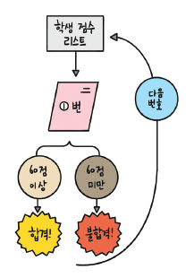


```python
#총 5명의 학생이 시험을 보았는데 시험 점수가 60점 이상이면 합격이고 그렇지 않으면 불합격이다. 합격인지, 불합격인지 결과를 보여 주시오.
marks = [90, 25, 67, 45, 80] # [15, 30, 80, 75, 60]

num = 0
for mark in marks:
    num += 1
    if 60 <= mark:
        print(f'{num}번 학생 합격!')
    else:
        print(f'{num}번 학생 불합격!')
```

    1번 학생 합격!
    2번 학생 불합격!
    3번 학생 합격!
    4번 학생 불합격!
    5번 학생 합격!


### for / continue 문 *


```python
marks = [90, 25, 67, 45, 80] # [15, 30, 80, 75, 60]

num = 0
for mark in marks:
    num += 1
    if 60 > mark:
        continue;
    print(f'{num}번 학생 {mark} 합격!')
    
```

    1번 학생 90 합격!
    3번 학생 67 합격!
    5번 학생 80 합격!


### for문과 range함수 **


```python
a = range(10) # 0 <= a < 10, ex   # js : for (let i =0; i < 10; i++)
print(list(a))
print(tuple(a))
print(set(a))

b = np.arange(10).tolist()
print(b)
```

    [0, 1, 2, 3, 4, 5, 6, 7, 8, 9]
    (0, 1, 2, 3, 4, 5, 6, 7, 8, 9)
    {0, 1, 2, 3, 4, 5, 6, 7, 8, 9}
    [0, 1, 2, 3, 4, 5, 6, 7, 8, 9]


- range함수의 예시


```python
add = 0
for i in range(1, 11):
    add += i
print(add)

add = 0
for i in np.arange(1, 11):
    add += i
print(add)
```

    55
    55


- 응용1


```python
marks = [90, 25, 67, 45, 80] # [15, 30, 80, 75, 60]

num = 0
for idx in range(len(marks)):
    num += 1
    if 60 > marks[idx]:
        continue;
    print(f'{num}번 학생 {mark} 합격!')
```

    1번 학생 80 합격!
    3번 학생 80 합격!
    5번 학생 80 합격!


- 응용2


```python
a = range(0, 10, 1)
b = range(10)
print(list(a))
print(list(b))
print(a == b)
print(list(range(4, 20, 2)))
print(list(range(10, 0 , -1)))
```

    [0, 1, 2, 3, 4, 5, 6, 7, 8, 9]
    [0, 1, 2, 3, 4, 5, 6, 7, 8, 9]
    True
    [4, 6, 8, 10, 12, 14, 16, 18]
    [10, 9, 8, 7, 6, 5, 4, 3, 2, 1]


```python
marks = [90, 25, 67, 45, 80]

for i, v in enumerate(marks):
    print(i, v)

```

    0 90
    1 25
    2 67
    3 45
    4 80


```python
add = 0
for i, v in enumerate(range(1, 11)):
    add += (v + i)
    print(add, v, i)
print(add)
```

    1 1 0
    4 2 1
    9 3 2
    16 4 3
    25 5 4
    36 6 5
    49 7 6
    64 8 7
    81 9 8
    100 10 9
    100


#### for, range를 이용한 구구단
- 별거아닌..


```python
out = ""

# 시간 읍읍..
# min_gugu = 1
# max_gugu = 10
# max_oneline = 5

for i in range(1, (6 + 1)):
    out += (f'{str(i) + "단":=^10}\t')

out += "\n"

for i in range(1, (9 + 1)):
    for j in range(1, (6 + 1)):
        out += f'{i} * {j} = {i * j}\t'
    out += '\n'
print(out)
```

    ====1단====	====2단====	====3단====	====4단====	====5단====	====6단====	
    1 * 1 = 1	1 * 2 = 2	1 * 3 = 3	1 * 4 = 4	1 * 5 = 5	1 * 6 = 6	
    2 * 1 = 2	2 * 2 = 4	2 * 3 = 6	2 * 4 = 8	2 * 5 = 10	2 * 6 = 12	
    3 * 1 = 3	3 * 2 = 6	3 * 3 = 9	3 * 4 = 12	3 * 5 = 15	3 * 6 = 18	
    4 * 1 = 4	4 * 2 = 8	4 * 3 = 12	4 * 4 = 16	4 * 5 = 20	4 * 6 = 24	
    5 * 1 = 5	5 * 2 = 10	5 * 3 = 15	5 * 4 = 20	5 * 5 = 25	5 * 6 = 30	
    6 * 1 = 6	6 * 2 = 12	6 * 3 = 18	6 * 4 = 24	6 * 5 = 30	6 * 6 = 36	
    7 * 1 = 7	7 * 2 = 14	7 * 3 = 21	7 * 4 = 28	7 * 5 = 35	7 * 6 = 42	
    8 * 1 = 8	8 * 2 = 16	8 * 3 = 24	8 * 4 = 32	8 * 5 = 40	8 * 6 = 48	
    9 * 1 = 9	9 * 2 = 18	9 * 3 = 27	9 * 4 = 36	9 * 5 = 45	9 * 6 = 54	
    


### 리스트 컴프리헨션 **


```python
# 일반적.
a = range(1, 5+1) # 1, 2, 3, 4, 5
res = []
print(list(a))

for num in a:
    res.append(num * 3)
print(res)
```

    [1, 2, 3, 4, 5]
    [3, 6, 9, 12, 15]


```python
# 리스트 컴프리헨션
a = range(1, 5+1) # 1, 2, 3, 4, 5
res = [num * 3 for num in a] # 기억할 것.
print(list(a))
print(res)
```

    [1, 2, 3, 4, 5]
    [3, 6, 9, 12, 15]


```python
# 리스트 컴프리헨션 (if와 사용할 때)
a = range(1, 5+1) # 1, 2, 3, 4, 5
res = [num * 3 for num in a if 0 == num%2] # 기억할 것.
print(list(a))
print(res)
```

    [1, 2, 3, 4, 5]
    [6, 12]


```python
# 
res = [ i*j for i in range(2, 10)
              for j in range(1, 10) ]
print(res)
```

    [2, 4, 6, 8, 10, 12, 14, 16, 18, 3, 6, 9, 12, 15, 18, 21, 24, 27, 4, 8, 12, 16, 20, 24, 28, 32, 36, 5, 10, 15, 20, 25, 30, 35, 40, 45, 6, 12, 18, 24, 30, 36, 42, 48, 54, 7, 14, 21, 28, 35, 42, 49, 56, 63, 8, 16, 24, 32, 40, 48, 56, 64, 72, 9, 18, 27, 36, 45, 54, 63, 72, 81]


### 풀이

1. 자판기 만들어보기
2. a) 물건 값 입력, b) 지불할 돈을 입력
3. 거스름돈을 계산.
   - 단, 1000원 짜리 몇장 500원 짜리 몇개 등으로 잔돈을 구비하여 출력.
4. 예) 물건 값: 3200원, 지불한 돈: 10000원.  
　　　　　　10000원 x 0장  
　　　　　　&nbsp;5000원 x 1장  
　　　　　　&nbsp;1000원 x 1장  
　　　　　　&nbsp;&nbsp;500원 x 1개  
　　　　　　&nbsp;&nbsp;100원 x 3개  
　　　　　　&nbsp;&nbsp;&nbsp;50원 x 0개 ...  
　　등의 표현으로 출력.  


```python
a = int( input('물건 값 입력 : ') or 3000 )
b = int( input('지불한 값 입력 : ') or 5000 )
money = [10000, 5000, 1000, 500, 100, 50 , 10]

# left money.
lm = b - a

if 0 > lm :
    print(f'돈 부족 합니다... 물건 값: {a}, 지불한 돈: {b}')
else:
    print(f'거스름돈 : {lm}') 
    # mcv : money count val
    for mcv in money:
        mc = int(lm / mcv)
        if money[-1] < lm: lm -= (mc * mcv)
        print(f'{mcv}원 x {mc}개')
```

    물건 값 입력 :  30000
    지불한 값 입력 :  143250


    거스름돈 : 113250
    10000원 x 11개
    5000원 x 0개
    1000원 x 3개
    500원 x 0개
    100원 x 2개
    50원 x 1개
    10원 x 0개


# 파이썬 입출력

## 함수

### 파이썬 함수


```python
def add(a, b):
    print('입력하신 {0}과 {1}을 더하면 {2}입니다.'.format(a, b, a + b))
    return a+b
```


```python
add(3, 4)
```

    입력하신 3과 4을 더하면 7입니다.


    7


### 매개변수와 인수

- 매개변수와 인수는 혼용  
      - 매개변수 : 함수에 입력으로 전달된 값을 받는 변수  
      - 인수     : 함수를 호출할 때 전달하는 입력값

### 입력값과 리턴값에 따른 함수의 형태

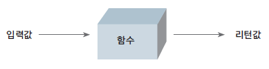

#### 일반적인 함수


```python
def mul(a, b):
    return a * b
```

#### 입력값이 없는 함수


```python
def say():
    print('I\'ll say that Hello Hi.')
    return 'Hi'
```


```python
a = say()
```

    I'll say that Hello Hi.


```python
print(a)
```

    Hi


```python
a = say # 함수의 복사 실행은 안됨.
```


```python
print(a)
print(a())
```

    <function say at 0xf03992a8>
    I'll say that Hello Hi.
    Hi


- 함수호출시 결과는 print함수가 포함될때는 나오며..
- 반환값 있을 경우 그 값을 찍을때 코드대로 반환값이 나오므로 혼동없길 바람.

#### 리턴값이 없는 함수


```python
def add(a, b):
    print("%d, %d의 합은 %d입니다." % (a, b, (a+b)))
```


```python
add( 3, 4 )
```

    3, 4의 합은 7입니다.


```python
a = add(3, 4)
print(a)
```

    3, 4의 합은 7입니다.
    None


#### 입력값도, 리턴값도 없는 함수


```python
def say():
    print('hi')
    # none return
```


```python
say()
```

    hi


### 매개변수를 지정하여 호출하기(초기값)


```python
def sub(a=7, b=3): # 순서는 상관없음(b=5, a=3)
    return a - b
```


```python
res = sub()
print(res)
```

    4


### 입력값이 몇 개가 될지 모를 때

#### 여러 개의 입력값을 받는 함수 만들기


```python
def add_many(*args):
    res = 0
    print(type(args), args)
    for i in args:
        res += i
    return res
```


```python
res = add_many(1,2,3,4,5,6,7,8,9,10)
print(res)
```

    <class 'tuple'> (1, 2, 3, 4, 5, 6, 7, 8, 9, 10)
    55


```python
def add_mul(choice, *args):
    if 'add' == choice:
        res = 0
        for i in args:
            res += i
    elif 'mul' == choice:
        res = 1
        for i in args:
            res *= i
    return res
```


```python
res = add_mul('add', 1,2,3,4,5)
res2 = add_mul('mul', 1,2,3,4,5)
print(res)
print(res2)
```

    15
    120


- 응용1 변수에 튜플담아서 변수에 *


```python
rp = 1,2,3,4,5,6,7,8,9
lt = [1,2,3,4,5,6,7,8,9,10]
res3 = add_mul('add', *rp)
res4 = add_mul('add', *lt)
print(res3)
print(res4)
```

    45
    55


- 응용2 args요소에 접근


```python
def add_new(*args):
    res = 0
    if 'add' == args[0][0]:
        carr = args[0][1:]
        for i in carr:
            res += i
    elif 'mul' == args[0][0]:
        res = 1
        carr = args[0][1:]
        for i in carr:
            res *= i
    return res
```


```python
ar = 'add',1,2,3,4,5,6,7,8,9
add_new(ar)
```


    45


#### 키워드 매개변수, kwargs*
- 키워드 매개변수를 사용할때는 매개변수 앞에 별 2개(**)를 붙인다.


```python
def dic_maker(**kwargs):
    print(f'func in {kwargs}')
    return kwargs
a = 1
print('func out', dic_maker(a=1, b=2))
```

    func in {'a': 1, 'b': 2}
    func out {'a': 1, 'b': 2}


### 함수의 리턴값은 언제나 하나이다.**


```python
def add2(a, b):
    print(f'{a+b}, {a*b}')
    return a+b, a*b
```


```python
add2(3, 4)
```

    7, 12


    (7, 12)


- 2개이상 리턴되면 결국 하나로 튜플에 묶여나옴
- 결국 리턴은 하나임을 보임


```python
def add3(a, b):
    if 0 == a: return
    print(f'1: {a+b}, {a*b}의 결과')
    return a+b
    print(f'2: {a+b}의 결과')
    return a*b
    print(f'3: {a*b}의 결과') # 절대 수행 안될듯함..
```


```python
result = add3( 3, 4 )
print( result )
res2 = add3( 0, 12434)
print(res2)
```

    1: 7, 12의 결과
    7
    None


### 매개변수에 초기값 미리 설정


```python
def say_myself(name, age, man=True): # 초기값은 마지막에 설정.
    print("my name is %s" % name)
    print("my age is %d" % age)

    if man:
        print( "I'm Man." )
    else:
        print( "I'm Woman" )
```


```python
say_myself("P", 27)
say_myself("P", 27, True)
```

    my name is P
    my age is 27
    I'm Man.
    my name is P
    my age is 27
    I'm Man.


### 함수 안에서 선언한 변수의 효력 볌위 **


```python
a = 1
def vartest(a):
    a = a + 1
    print(a)
vartest(a)
print(a)
```

    2
    1


### 함수 안에서 함수 밖의 변수를 변경하는 방법 *

#### 1) return 사용하기 <어쩔수 없는 방법중에 제일 좋은 방법>


```python
a = 1
def vartest(a):
    a = a + 1
    return a
a = vartest(a)
print(a)
```

    2


#### global 명령어 사용;; <될 수 있으면 피해야되는 방법>


```python
a = 1
def vartest():
#    ''' return값 대체를 추천. '''
    """ return값 대체를 추천. """
    global a
    a = a + 1
    print(a)
vartest()
print(a)
```

    2
    2


```python
vartest.__doc__
```


    ' return값 대체를 추천. '


- js에서는 var에서는 자체가 전역이라 아무대나 적용됨 함수내든...
- 그래서 사장된 기능.. let, const 쓰게되는 근황이라고..
- 전역은 안쓰길 권장하는 추세 관리가 힘듬;;

### lambda 예약어 *

- 함수_이름 = lambda 매개변수1, 매개변수2, ... : 매개변수를_이용한_표현식


```python
add = lambda a, b: a+b
result = add(3, 4)
print(result)
```

    7


## 사용자 입출력


### 사용자 입력 활용

#### input 사용하기 *
- 여기 들어가는 모든 내용은 **문자열로 저장**


```python
a = input() # 숫자 입력을 원할 시에는 int로 감싸야한다.
type(a)
```

     123


    str


#### 프롬프트 띄워 사용자 입력받기


```python
a = int(input('숫자 입력하기 : ') or 1234)
print(a)
```

    숫자 입력하기 :  


    1234


### print 자세히 알기

#### 큰 따옴표로 둘러싸인 문자열은 + 연산과 동일하다.


```python
print("lief" "is" "too short")
print("lief"+"is"+"too short")
print("lief", "is", "too short")
```

    liefistoo short
    liefistoo short
    lief is too short


- 위와 같은 특성은 숙지해두기;;


```python
for i in range(10):
    print(i, end=" ")  # 이어쓰기
print(f'\n{"="* 20}')  # 기본 end 값은 \n rogod.
for j in range(10):
    print(i, end="\r") # 덮어쓰기
```

    0 1 2 3 4 5 6 7 8 9 
    ====================
    9

- 이것도 마찬가지.

## 파일 읽고 쓰기

<head>
    <style>
        table {
            float: center;
            font-size: 1.2rem;
        }
    </style>
</head>
<table>
<thead>
<tr>
<th>파일열기모드</th>
<th>설명</th>
</tr>
</thead>
<tbody>
<tr>
<td>r</td>
<td>읽기 모드: 파일을 읽기만 할 때 사용한다.</td>
</tr>
<tr>
<td>w</td>
<td>쓰기 모드: 파일에 내용을 쓸 때 사용한다.</td>
</tr>
<tr>
<td>a</td>
<td>추가 모드: 파일의 마지막에 새로운 내용을 추가할 때 사용한다.</td>
</tret>>
</tbody>
</table>

<fieldset>
    <legend>파일 읽고 쓰기</legend>
    <strong>파일 경로와 슬래시(<code>/</code>)</strong><p></p>
    <p>파이썬 코드에서 파일 경로를 표시할 때 <code>"C:/doit/새파일.txt"</code>처럼 슬래시(/)를 사용할 수 있다. 만약 역슬래시(<code>\</code>)를 사용한다면 <code>"C:\\doit\\새파일.txt"</code>처럼 역슬래시를 2개 사용하거나 <code>r"C:\doit\새파일.txt"</code>와 같이 문자열 앞에 r 문자(raw string)를 덧붙여 사용해야 한다. 왜냐하면 <code>"C:\note\test.txt"</code>처럼 파일 경로에 <code>\n</code>과 같은 이스케이프 문자가 있을 경우, 줄바꿈 문자로 해석되어 의도했던 파일 경로와 달라지기 때문이다.
    </p>
</fieldset>

### 파일 생성하기


```python
# 다음에는 './out/..' 이 경로에 출력.
# 1set.
f = open("newfile.txt", 'w')
f.close()
```

- 참고사항..
    - 리눅스 기반은 (/), 윈도우 기반은 (\) 개행및 파일경로 구분을 한다고...

### 파일을 쓰기 모드로 열어 내용 쓰기


```python
f = open("newfile.txt", 'w')

for i in range(1, 11):
    data = f'{i}번째 줄 입니다.\n'
    f.write(data)
f.close()
```

### 파일을 읽는 여러가지 방법

#### readline 함수 이용


```python
f = open('./newfile.txt', 'r')
# 단일로만 쓰면.. 계속 읽어야됨..
# line = f.readline()
while True:
    line = f.readline()
    if not line: break
    print(line)
f.close()
```

    1번째 줄 입니다.
    
    2번째 줄 입니다.
    
    3번째 줄 입니다.
    
    4번째 줄 입니다.
    
    5번째 줄 입니다.
    
    6번째 줄 입니다.
    
    7번째 줄 입니다.
    
    8번째 줄 입니다.
    
    9번째 줄 입니다.
    
    10번째 줄 입니다.
    


```python
f = open('./newfile.txt', 'r')
lines = f.readlines()
# 아래처럼 출력하면 개행공백(\n) 까지..
# for line in lines:
#     print(line)
# 아래와 같이 개행 제거.
for line in lines:
    line = line.strip()
    print(line)
f.close()
```

    1번째 줄 입니다.
    2번째 줄 입니다.
    3번째 줄 입니다.
    4번째 줄 입니다.
    5번째 줄 입니다.
    6번째 줄 입니다.
    7번째 줄 입니다.
    8번째 줄 입니다.
    9번째 줄 입니다.
    10번째 줄 입니다.


```python
f = open("newfile.txt", 'w')

for i in range(1, 11):
    data = f'{i}번째 줄 데이터는 {2**i} 입니다.\n'
    print(data)
    f.write(data)
f.close()
```

    1번째 줄 데이터는 2 입니다.
    
    2번째 줄 데이터는 4 입니다.
    
    3번째 줄 데이터는 8 입니다.
    
    4번째 줄 데이터는 16 입니다.
    
    5번째 줄 데이터는 32 입니다.
    
    6번째 줄 데이터는 64 입니다.
    
    7번째 줄 데이터는 128 입니다.
    
    8번째 줄 데이터는 256 입니다.
    
    9번째 줄 데이터는 512 입니다.
    
    10번째 줄 데이터는 1024 입니다.
    


```python
f = open('./newfile.txt', 'r')
lines = f.readlines()
for line in lines:
    line = line.strip()
    print(line)
f.close()
```

    1번째 줄 데이터는 2 입니다.
    2번째 줄 데이터는 4 입니다.
    3번째 줄 데이터는 8 입니다.
    4번째 줄 데이터는 16 입니다.
    5번째 줄 데이터는 32 입니다.
    6번째 줄 데이터는 64 입니다.
    7번째 줄 데이터는 128 입니다.
    8번째 줄 데이터는 256 입니다.
    9번째 줄 데이터는 512 입니다.
    10번째 줄 데이터는 1024 입니다.


### 파일에 새로운 내용 추가하기


```python
f = open("./out/newfile2.txt", 'w')

for i in range(1, 11):
    data = f'{i}번째 줄 입니다.\n'
    f.write(data)
f.close()
```


```python
fr = open("./out/newfile2.txt", "r")
print(fr.read())
fr.close()
print(f'{"="*30}')

fa = open("./out/newfile2.txt", "a")
for i in range(11, 21):
    data = "{0}번째 줄 입니다.\n".format(i)
    fa.write(data)

fa.close()

fr = open("./out/newfile2.txt", "r")
print(fr.read())
fr.close()
```

    1번째 줄 입니다.
    2번째 줄 입니다.
    3번째 줄 입니다.
    4번째 줄 입니다.
    5번째 줄 입니다.
    6번째 줄 입니다.
    7번째 줄 입니다.
    8번째 줄 입니다.
    9번째 줄 입니다.
    10번째 줄 입니다.
    
    ==============================
    1번째 줄 입니다.
    2번째 줄 입니다.
    3번째 줄 입니다.
    4번째 줄 입니다.
    5번째 줄 입니다.
    6번째 줄 입니다.
    7번째 줄 입니다.
    8번째 줄 입니다.
    9번째 줄 입니다.
    10번째 줄 입니다.
    11번째 줄 입니다.
    12번째 줄 입니다.
    13번째 줄 입니다.
    14번째 줄 입니다.
    15번째 줄 입니다.
    16번째 줄 입니다.
    17번째 줄 입니다.
    18번째 줄 입니다.
    19번째 줄 입니다.
    20번째 줄 입니다.
    


### with문과 함께 사용하기. *
- 다만 상황에 따라 불편할 수 있으므로주의;;


```python
with open('./newfile.txt', 'r') as f:
# print(f)
    for line in f:
        print(line.strip())

```

    1번째 줄 데이터는 2 입니다.
    2번째 줄 데이터는 4 입니다.
    3번째 줄 데이터는 8 입니다.
    4번째 줄 데이터는 16 입니다.
    5번째 줄 데이터는 32 입니다.
    6번째 줄 데이터는 64 입니다.
    7번째 줄 데이터는 128 입니다.
    8번째 줄 데이터는 256 입니다.
    9번째 줄 데이터는 512 입니다.
    10번째 줄 데이터는 1024 입니다.


## 프로그램 입출력

### sys 모듈 사용하기


```python
import sys
args = sys.argv
print(args)
```

    ['/home/pi01/venv/lib/python3.11/site-packages/ipykernel_launcher.py', '-f', '/home/pi01/.local/share/jupyter/runtime/kernel-9f7e796f-4511-4ee1-a871-e403d4e4a0c5.json']


```python
with open("./out/sys1.py", "w") as f:
    data = '''import sys
args = sys.argv
print(args)
for i in args:
    print(i)
'''
    f.write(data)
print("생성완료!")
```

    생성완료!


```python
!python ./out/sys1.py aa bb cc
```

    ['./out/sys1.py', 'aa', 'bb', 'cc']
    ./out/sys1.py
    aa
    bb
    cc


```python
with open("./out/sys2.py", "w") as f:
    data = '''import sys
args = sys.argv[1:]
print(args)

for i in args:
    print(i.upper(), end=' ')
'''
    f.write(data)
print('생성완료!')
```

    생성완료!


```python
!python ./out/sys2.py life is too shOrt, You need python!
```

    ['life', 'is', 'too', 'shOrt,', 'You', 'need', 'python!']
    LIFE IS TOO SHORT, YOU NEED PYTHON! 

### 과제
- 메모장 만들기
    - jupyter lab에서만 memo.py이름으로 파일 생성
    - python [memo.py](http://memo.py) memo.txt -w “Life is too short”를 작성시
        
        memo.txt 파일에 “Life is too short”의 내용이 저장됨.
        
    - python [memo.py](http://memo.py) memo.txt -a “This is my Memo App!”
        
        을 작성하면
        
        memo.txt 파일에 “This is my Memo App!”의 내용이 추가됨.
        
    - python [memo.py](http://memo.py) memo.txt -r 치면 내용을 읽어옴.


```python
with open("./out/memo.py", "w") as f:
    data = '''import sys

# argument exception.
if 3 > len(sys.argv):
    print(f"not enough argument : {len(sys.argv)}")
    sys.exit()

# file exception.
file = [s for s in sys.argv[1:] if '.txt' in s]
print(file[0])
if not file or 1 < len(file):
    print(f"input filename exactly include name. now.. {sys.argv}")
    sys.exit()

# op exception.
op = [s for s in sys.argv if '-' in s]

if 2 <= len(op):
    print(f"only one '-' option. now.. {op}")
    sys.exit()

if not op:
    print(f"can't process '-' option;; now.. {sys.argv}")
    sys.exit()

if 1 != len(op) or op[0] not in ['-w', '-a', '-r']:
    print(f"wrong in option argument. (e ex) '-w', '-r', '-a') now.. : {op}")
    sys.exit()

# change compare char.
op = op[0][1]

# str exception.
# ...

str = sys.argv[-1]

with open(f"{file[0]}", op) as f:
    if 'w' == op or 'a' == op:
        print('this write : ', str)
        f.write(str + ' ')

    if 'r' == op:
        print(f.read())
'''
    f.write(data)
print('./out/memo.py 생성완료!')
```

    ./out/memo.py 생성완료!


```python
!python ./out/memo.py -w ./out/memo.txt "Life is too short"
```

    ./out/memo.txt
    this write :  Life is too short


```python
!python ./out/memo.py -a ./out/memo.txt "This is my Memo App!"
```

    ./out/memo.txt
    this write :  This is my Memo App!


```python
!python ./out/memo.py -r ./out/memo.txt
```

    ./out/memo.txt
    Life is too short This is my Memo App! 


# 파이썬 확장

## 클래스

### 클래스와 객체
- 제품 찍 틀 = 클래스
- 제품틀로 찍어 생산해낸 제품(철, 과자 등등) = 객체
<fieldset><legend>파이썬 클래스</legend>
<strong>객체와 인스턴스의 차이</strong><p></p>
<p>클래스로 만든 객체를 ‘인스턴스’라고도 한다. 그렇다면 객체와 인스턴스의 차이는 무엇일까? 이렇게 생각해 보자. <code>a = Cookie()</code>로 만든 a는 객체이다. 그리고 a 객체는 Cookie의 인스턴스이다. 즉, 인스턴스라는 말은 특정 객체(a)가 어떤 클래스(Cookie)의 객체인지를 관계 위주로 설명할 때 사용한다. ‘a는 인스턴스’보다 ‘a는 객체’라는 표현이 어울리며 ‘a는 Cookie의 객체’보다 ‘a는 Cookie의 인스턴스’라는 표현이 훨씬 잘 어울린다.
</p></fieldset>


```python
class Cookie:
    pass
```

### 사칙 연산 클래스 만들기

#### 어떻게 만들지 먼저 구상하기

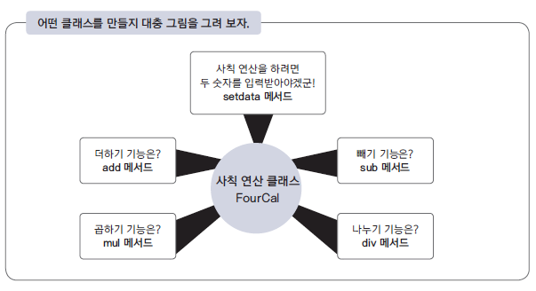

#### 클래스 구조 만들기


```python
class FourCal:
    pass

a = FourCal()
print(type(a))
print(a)
```

    <class '__main__.FourCal'>
    <__main__.FourCal object at 0xee9d4f30>


#### 객체에 연산할 숫자 지정하기


```python
class FourCal:
    def setdata(self, first, second):
        self.first = first
        self.second = second
```

#### 더하기 기능 만들기


```python
class FourCal:
    def setdata(self, first, second):
        self.first = first
        self.second = second
    def add(self):
        return self.first + self.second
    def minus(self):
        return self.first - self.second
    def mul(self):
        return self.first * self.second
    def div(self):
        return self.first / self.second
```


```python
a = FourCal()
a.setdata(3, 4)
print(a.add())
b = FourCal()
b.setdata(11, 3)
print(b.minus())
c = FourCal()
c.setdata(2, 4)
print(c.mul())
print(a.first)
print(b.first)
print(c.first)
```

    7
    8
    8
    3
    11
    2


```python
class Vack:
    def my(selfID, won, ea):
        selfID.won = won
        selfID.ea = ea
    def dduk(selfID):
        res = selfID.won * selfID.ea
        print("떡볶이 집에서 %d원치 먹었다." %res)
    def man(selfID):
        res = selfID.won + selfID.won
        print("만두 집에서 %d원치 먹었다." %res)
```


```python
a = Vack()
b = Vack()
c = Vack()
```


```python
a.my(2200, 8)
b.my(800, 10)
c.my(1100, 7)
```


```python
a.dduk()
```

    떡볶이 집에서 17600원치 먹었다.


```python
b.dduk()
```

    떡볶이 집에서 8000원치 먹었다.


```python
c.dduk()
```

    떡볶이 집에서 7700원치 먹었다.


```python
a.man()
```

    만두 집에서 4400원치 먹었다.


```python
b.man()
```

    만두 집에서 1600원치 먹었다.


```python
c.man()
```

    만두 집에서 2200원치 먹었다.


#### 곱하기, 빼기, 나누기, 기능 만들기


```python
# 위에있는 코드 가져옴.
class FiveCal:
    name = "Bexco" # 변수선언..
    def __init__(self, first, second):
        self.first = first
        self.second = second
    def setdata(self, first, second):
        self.first = first
        self.second = second
    def add(self):
        return self.first + self.second
    def minus(self):
        return self.first - self.second
    def mul(self):
        return self.first * self.second
    def div(self):
        return self.first / self.second
    def mod(self):
        return self.first % self.second
```


```python
a = FourCal(0, 0)
b = FourCal(0, 0)

a.setdata(4, 2)
b.setdata(3, 8)

print(a.add())
print(a.mul())
print(a.div())
print(a.add())
print(b.mod())
```

    6
    8
    2.0
    6
    3


### 생성자


```python
a = FiveCal(3, 7)
a.add()
```


    10


### 클래스의 상속
<fieldset><legend>클래스의 상속</legend>
<strong>상속 기능은 왜 쓰는 걸까?</strong><p></p>
<p>보통 상속은 기존 클래스를 변경하지 않고 기능을 추가하거나 기존 기능을 변경하려고 할 때 사용한다. ‘클래스에 기능을 추가하고 싶으면 기존 클래스를 수정하면 되는데 왜 굳이 상속을 받아서 처리해야 하지?’라는 의문이 들 수도 있다. 하지만 기존 클래스가 라이브러리 형태로 제공되거나 수정이 허용되지 않는 상황이라면 상속을 사용해야 한다.
</p></fieldset>


```python
class SixCal(FiveCal):
    pass
```


```python
aa = SixCal(7, 3)
aa.mod()
```


    1


```python
class SixCal(FiveCal):
    def pow(self):
        return self.first ** self.second
```


```python
aa = SixCal(2, 16)
aa.pow()
```


    65536


### 메서드 오버라이딩 *
- 이름이 같을 경우 동일한 이름으로 업데이트


```python
class NewCal(SixCal):
    def div(self):
        if 0 == self.second:
            return 0
        else:
            return self.first / self.second
```


```python
aa = NewCal(10, 0)
aa.div()
```


    0


### 클래스변수
- 클래스의 필드에 변수의 작성
- 실제 변경및 추가에도 가능(아래 예시)
- 클래스변수는 객체변수와 달리 클래스로 만든 모든 객체에 공유된다는 특징이 있다.


```python
class Student:
    name = "Mr.P"
```


```python
Student.name
```


    'Mr.P'


```python
a = Student()
b = Student()
print(a.name)
print(b.name)
```

    Mr.P
    Mr.P


```python
Student.name = "Mr.D"
print(a.name)
print(b.name)
Student.lname = "doman" # 새로생성.
print(a.lname)
print(b.lname)
```

    Mr.D
    Mr.D
    doman
    doman


### 클래스 응용


```python
# Basic Unit Class.
class Unit:
    hp = 100
    sp = 30
    level = 0
    def __init__(self, level):
        self.level = level
        self.hp = (self.level * 30)
        self.sp = (self.level * 10)
    def eat(self):
        print('delicious!')
        self.hp += 10
    def say(self):
        print(f'My level is {self.level}')
        print(f'My now hp is {self.hp}')
        print(f'My now sp is {self.sp}')
    def move(self):
        print('move!')
        self.sp -= 1
```


```python
a = Unit(1)
b = Unit(3)
c = Unit(20)
```


```python
a.eat(), a.say(), a.move()
b.eat(), b.say(), b.move()
c.eat(), c.say(), c.move()
```

    delicious!
    My level is 1
    My now hp is 50
    My now sp is 9
    move!
    delicious!
    My level is 3
    My now hp is 110
    My now sp is 29
    move!
    delicious!
    My level is 20
    My now hp is 620
    My now sp is 199
    move!


    (None, None, None)


```python
# 상속
class Warrior(Unit):
    def Skill(self):
        print(f'Active Count {self.level} Sword Skill.')
        sp -= 2
```


```python
war1 = Warrior(7)
war1.say()
war1.Skill()
```

    My level is 7
    My now hp is 210
    My now sp is 70
    Active Count 7 Sword Skill.


```python
# 오버라이딩
class Sorceress(Unit):
    mp = 10
    def __init__(self, level):
        self.level = level
        self.hp = (self.level * 30)
        self.sp = (self.level * 10)
        self.mp = (self.level * 10)
    def Skill(self):
        if self.level < 6:
            print(f'Active Count {self.level} Ice Bolt Skill.')
            self.mp -= 1
        else:
            print(f'Active Count {self.level} Blizzard Skill.')
            self.mp -= 3
        
```


```python
sor1 = Sorceress(5)
sor2 = Sorceress(17)
sor1.say()
sor1.Skill()
sor2.say()
sor2.Skill()
```

    My level is 5
    My now hp is 150
    My now sp is 50
    Active Count 5 Ice Bolt Skill.
    My level is 17
    My now hp is 510
    My now sp is 170
    Active Count 17 Blizzard Skill.


#### 과제 - 클래스 구현


```python
import re
import time

class Phone:
    def __init__(self, pnum, model):
        self.pnum = pnum
        self.model = model
        self.pset = set([])
    def call(self, t_pnum):
        print(f'{self.pnum} to call {t_pnum}')
        self.pset.add(t_pnum)
    def messenger(self, t_pnum, tomsg):
        print(f'{self.pnum} to msg {t_pnum}; this msg is {tomsg}')
        self.pset.add(t_pnum)
    def camcall(self, t_pnum):
        print(f'{self.pnum} to CamCall {t_pnum}')
        self.pset.add(t_pnum)
    def Speed(self):
        mnum = re.findall('\d+', 's21')[0]
        print(f'속도가 {mnum}배 빠릅니다.')
```


```python
class SmartPhone(Phone):
    def __init__(self, pnum, account, model):
        super().__init__(pnum, model)
        self.applist = []
        self.myaccount = account;
    def websuffing(self, url):
        print(f'web connect to {url}')
    def InstallApp(self, app):
        print(f'Target {app} Install!')
        self.Installing()
        self.applist.insert(-1, app)
        print(f'Target {app} Installed!')
    def IBanking(self, money, account = ''):
        if 0 >= len(account): account = self.myaccount
        print(f'액수 {money}를 해당 {account}로 보냅니다.')
    def Speed(self):
        mnum = int(re.findall('\d+', 's21')[0])
        for c in range(mnum):
            print(f'{c + 1}번 스마트하게 출력.')

    #private
    def Installing(self):
        str = '>'
        for i in range(101):
            # 여기서 print에 , end '\r' 이 의미는 개행하지 않고 그 라인에
            print(f'{i:<3}% >>> |{str * (i//5):<20}|', end='\r')
            str
            time.sleep(0.1)
```


```python
class SecurePhone(Phone):
    def __init__(self, pnum, account, model):
        super().__init__(pnum, model)
        self.applist = []
        self.myaccount = account;
    def InstallApp(self, app):
        print(f'Target {app} Install!')
        self.Installing()
        self.applist.insert(-1, app)
        print(f'Target {app} Installed!')
    def IBanking(self, money, account = ''):
        if 0 >= len(account): account = self.myaccount
        print(f'액수 {money}를 해당 {account}로 보냅니다.')
    def Speed(self):
        mnum = int(re.findall('\d+', 's21')[0])
        if 20 >= mnum:
            print('s20 이하는 보안으로 동작되지 않습니다.')
        else:
            print('s21 이상은 보안이 적용되고 있습니다.')
        print(f'현재 모델 : {self.model}')
    
    #private
    def Installing(self):
        str = '>'
        for i in range(101):
            # 여기서 print에 , end '\r' 이 의미는 개행하지 않고 그 라인에
            print(f'{i:<3}% >>> |{str * (i//5):<20}|', end='\r')
            str
            time.sleep(0.1)
```


```python
a = Phone('010-3321-5453', 's12')
b = SmartPhone('010-3241-9999', '334-11112', 's21')
c = SecurePhone('010-1234-5678', '3AB-12345', 's23')
d = SecurePhone('010-9876-5432', '3AB-C1234', 's8')
```


```python
a.call(b.pnum)
a.messenger(c.pnum, 'hello Mr.C')
a.camcall(d.pnum)
a.Speed()
```

    010-3321-5453 to call 010-3241-9999
    010-3321-5453 to msg 010-1234-5678; this msg is hello Mr.C
    010-3321-5453 to CamCall 010-9876-5432
    속도가 21배 빠릅니다.


```python
b.call(a.pnum)
b.messenger(c.pnum, 'hello Mr.C')
b.camcall(d.pnum)
b.InstallApp('mydiary')
b.IBanking(30000)
b.Speed()
```

    010-3241-9999 to call 010-3321-5453
    010-3241-9999 to msg 010-1234-5678; this msg is hello Mr.C
    010-3241-9999 to CamCall 010-9876-5432
    Target mydiary Install!
    Target mydiary Installed!>>>>>|
    액수 30000를 해당 334-11112로 보냅니다.
    1번 스마트하게 출력.
    2번 스마트하게 출력.
    3번 스마트하게 출력.
    4번 스마트하게 출력.
    5번 스마트하게 출력.
    6번 스마트하게 출력.
    7번 스마트하게 출력.
    8번 스마트하게 출력.
    9번 스마트하게 출력.
    10번 스마트하게 출력.
    11번 스마트하게 출력.
    12번 스마트하게 출력.
    13번 스마트하게 출력.
    14번 스마트하게 출력.
    15번 스마트하게 출력.
    16번 스마트하게 출력.
    17번 스마트하게 출력.
    18번 스마트하게 출력.
    19번 스마트하게 출력.
    20번 스마트하게 출력.
    21번 스마트하게 출력.


```python
c.call(a.pnum)
c.messenger(b.pnum, 'hello Mr.B')
c.camcall(d.pnum)
c.InstallApp('mySecure')
c.IBanking(15000)
c.Speed()
```

    010-1234-5678 to call 010-3321-5453
    010-1234-5678 to msg 010-3241-9999; this msg is hello Mr.B
    010-1234-5678 to CamCall 010-9876-5432
    Target mySecure Install!
    Target mySecure Installed!>>>>|
    액수 15000를 해당 3AB-12345로 보냅니다.
    s21 이상은 보안이 적용되고 있습니다.
    현재 모델 : s23


```python
d.call(a.pnum)
d.messenger(b.pnum, 'hello Mr.B')
d.camcall(c.pnum)
d.Speed()
```

    010-9876-5432 to call 010-3321-5453
    010-9876-5432 to msg 010-3241-9999; this msg is hello Mr.B
    010-9876-5432 to CamCall 010-1234-5678
    s21 이상은 보안이 적용되고 있습니다.
    현재 모델 : s8


## 모듈 **

<fieldset><legend>import와 실행</legend>
<strong><code>__name__</code> 변수란?</strong><p></p>
<p>파이썬의 <code>__name__</code> 변수는 파이썬이 내부적으로 사용하는 특별한 변수 이름이다. 만약 <code>C:\doit&gt;python mod1.py</code>처럼 직접 mod1.py 파일을 실행할 경우, mod1.py의 <code>__name__</code> 변수에는 <code>__main__</code> 값이 저장된다. 하지만 파이썬 셸이나 다른 파이썬 모듈에서 mod1을 import할 경우에는 mod1.py의 <code>__name__</code> 변수에 mod1.py의 모듈 이름인 mod1이 저장된다.</p>
<pre><code class="language-python hljs md-csc-wrap"><button class="md-csc-button btn btn-xs btn-default"><span class="copymsg">Copy</span></button><span class="hljs-meta">&gt;&gt;&gt; </span><span class="hljs-keyword">import</span> mod1
<span class="hljs-meta">&gt;&gt;&gt; </span>mod1.__name__
<span class="hljs-string">'mod1'</span>
</code></pre>
<p></p></fieldset>


```python
with open('mod1.py', 'w') as f:
    data = '''def add(a,b):
    return a+b
def sub(a,b):
    return a-b
'''
    f.write(data)
```


```python
import mod1
print(mod1.add(3,4))
print(mod1.sub(7,3))
```

    7
    4


```python
from mod1 import add, sub
print(add(3, 4))
print(sub(7,3))
```

    7
    4


```python
from mod1 import * # 단점.. 충돌 및 필요없는 애들 다 가져올 수 있음.
print(add(3, 4))
print(sub(7,3))
```

    7
    4


```python
__name__ # 현 scope 
```


    '__main__'


```python
with open('mod1.py', 'a') as f:
    data = '''print(add(1,4))
print(sub(4,2))
'''
    f.write(data)
```


```python
import mod1
```

    5
    2


```python
!python mod1.py
```

    5
    2


```python
with open('mod1.py', 'a') as f:
    data = '''print(__name__)'''
    f.write(data)
```


```python
!python mod1.py
```

    5
    2
    __main__


```python
import mod1
```


```python
with open('mod1.py', 'a') as f:
    data = '''if "__main__" == __name__:
    print(add(1,4))
    print(sub(4,2))'''
    f.write(data)
```


```python
!python mod1.py
```

    5
    2


```python
import mod1
```

### 클래스나 변수 등을 포함한 모듈


```python
f = open('mod2.py', 'w')
data = '''
PI = 3.141592

class Math:
    def solv(self, r):
        return PI * (r**2)

def add(a, b):
    return a + b'''
f.write(data)
f.close()
```


```python
f = open('mod2.py', 'r')
print(f.read())
f.close()
```

    
    PI = 3.141592
    
    class Math:
        def solv(self, r):
            return PI * (r**2)
    
    def add(a, b):
        return a + b


```python
import mod2
print(mod2.PI)
```

    3.141592


```python
a = mod2.Math() # new Instance from Class.
print(a.solv(2))
```

    12.566368


```python
print(mod2.add(mod2.PI, 4.4))
```

    7.5415920000000005


```python
f = open('mod2.py', 'a')
data = '''
class Math2:
    def __init__(self, r=3):
        self.r = r
    def solv(self):
        return PI * (self.r**2)
'''
f.write(data)
f.close()
```


```python
f = open('mod2.py', 'r')
print(f.read())
f.close()
```

    
    PI = 3.141592
    
    class Math:
        def solv(self, r):
            return PI * (r**2)
    
    def add(a, b):
        return a + b
    class Math2:
        def __init__(self, r=3):
            self.r = r
        def __new__(cls):
            return PI * (self.r**2)
    


```python
import mod2 as m2
a = m2.Math2()
print(a.solv())
```

    28.274328


#### 별도로 실험


```python
f = open('mod2.py', 'w')
data = '''
PI = 3.141592

class Math:
    def solv(self, r):
        return PI * (r**2)

def add(a, b):
    return a + b'''
f.write(data)
f.close()
```


```python
f = open('mod2.py', 'a')
data = '''
class Math2:
    def __new__(cls, r=3):
        return PI * (r**2)
'''
f.write(data)
f.close()
```


```python
f = open('mod2.py', 'r')
print(f.read())
f.close()
```

    
    PI = 3.141592
    
    class Math:
        def solv(self, r):
            return PI * (r**2)
    
    def add(a, b):
        return a + b
    class Math2:
        def __new__(cls, r=3):
            return PI * (r**2)
    


```python
import mod2 as m2
a = m2.Math2()
print(a)
```

    28.274328


```python
# 한번더 __init__ 함수로 가능할까?
f = open('mod2.py', 'w')
data = '''
PI = 3.141592

class Math:
    def solv(self, r):
        return PI * (r**2)

def add(a, b):
    return a + b
    
class Math2:
    def __init__(self, r=3):
        return PI * (r**2)'''
f.write(data)
f.close()
```


```python
f = open('mod2.py', 'r')
print(f.read())
f.close()
```

    
    PI = 3.141592
    
    class Math:
        def solv(self, r):
            return PI * (r**2)
    
    def add(a, b):
        return a + b
        
    class Math2:
        def __init__(self, r=3):
            return PI * (r**2)


```python
import mod2 as m2
a = m2.Math2()
print(a)
```

- python 문서보니...  
    __init__() 에서는 절대 return을 남기면 안된다고 한다. org...
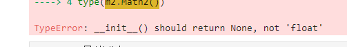

### 다른 파일에서 모듈 불러오기
- 파일이 동일한 디렉터리에 있어야 한다.

### 다른 디렉터리에 잇는 모듈을 불러오는 방법

#### sys.path.append 사용하기 (기록)


```python
import sys
sys.path
```


    ['/home/pi01/py_test/py_data/Lec',
     '/usr/lib/python311.zip',
     '/usr/lib/python3.11',
     '/usr/lib/python3.11/lib-dynload',
     '',
     '/home/pi01/venv/lib/python3.11/site-packages']


```python
type(sys.path)
```


    list


```python
!pwd
!ls
```

    /home/pi01/py_test/py_data/Lec
    LSH_Lab.ipynb	Type_files   mod1.py	  newfile2.txt	res
    PyNote01.ipynb	__pycache__  mod2.py	  out		tempOutput.ipynb
    Type.md		lscript.py   newfile.txt  py_mtea.py	tempOutput.md


```python
# sys.path.insert(-1, '')
```

#### PYTHONPATH 환경 변수 사용하기 (즉석 : jlab 콘솔 다시실행시 날라감..)
- 맥이나 유닉스 환경에서는 set 대신 export 명령 사용해야.

## 패키지 **
- 파이썬에서 패키지(packages)란 관련 있는 모듈의 집합을 말한다. 패키지는 파이썬 모듈을 계층적(디렉터리 구조)으로 관리할 수 있게 해 준다.
- 파이썬에서 모듈은 하나의 .py 파일이다.

### 패키지 만들기


```python
import os
os.getcwd() # 현재 경로 파악.
# os.mkdir('pkg') # 경로상에 폴더 생성.
# os.mkdir('pkg/sound')
# os.mkdir('pkg/graphic')
# exist_ok=True : 있다면 에러무시.. 덮어씌우던가..
# os.makedirs('pkg/sound', exist_ok=True) # pkg-sound 디랙토리 전부 생성.

# 아무튼.. 이렇게 많은 단계의 폴더생성이 가능하다..
# os.makedirs('1/2/3/4/5/6/7')
```


    '/home/pi01/py_test/py_data/Lec'


```python
os.makedirs('pkg/sound')
os.makedirs('pkg/graphic')
```


```python
with open('pkg/__init__.py', 'w'):
    pass

with open('pkg/sound/__init__.py', 'w'):
    pass

with open('pkg/graphic/__init__.py', 'w'):
    pass
```


```python
f = open('pkg/sound/echo.py', 'w')
data = '''
def echo_test():
    print("echo")'''
f.write(data)
f.close()
```


```python
f = open('pkg/graphic/render.py', 'w')
data = '''
def render_test():
    print("render")'''
f.write(data)
f.close()
```


```python
!pwd
```

    /home/pi01/py_test/py_data/Lec


```python
!export PYTHONPATH=/home/pi01/py_test/py_data/Lec
```


```python
# !python lscript.L6_Check(3)
```

### 패키지 안의 함수 실행하기

#### echo 모듈을 import하여 실행.


```python
import pkg.sound.echo

pkg.sound.echo.echo_test()
```

    echo


```python
# 길면 별칭 쓰기;;
import pkg.sound.echo as echo

echo.echo_test()
```

    echo


```python
import pkg.graphic.render as rd

rd.render_test()
```

    render


#### echo 모듈이 있는 디렉터리까지를 from ... import 하여 실행


```python
from pkg.sound import echo
echo.echo_test()
```

    echo


#### echo 모듈의 echo_test 함수를 직접 import하여 실행.


```python
from pkg.sound.echo import echo_test

echo_test()
```

    echo


- 도트 연산자{.}를 사용하여 import a.b.c 처럼 import할 때 가장 마지막 항목인 c는 반드시 모듈 또는 패키지 여야 함.

### \_\_init\_\_.py의 용도 *
- __init__.py 파일은 해당 디렉터리가 패키지의 일부임을 알려 주는 역할을 한다. 만약 game, sound, graphic 등 패키지에 포함된 디렉터리에 __init__.py 파일이 없다면 패키지로 인식되지 않는다.
<blockquote>

<p>python 3.3 버전부터는 <code>__init__.py</code> 파일이 없어도 패키지로 인식한다(<a class="wiki_link" data-title="PEP" data-wiki="/page/wiki/PEP" href="javascript:void(0)">PEP</a> 420). 하지만 하위 버전 호환을 위해 <code>__init__.py</code> 파일을 생성하는 것이 안전한 방법이다.</p>
</blockquot

- 또한, __init__.py 파일은 패키지와 관련된 설정이나 초기화 코드를 포함할 수 있다. 다양한 방법으로 활용할 수 있다.e>

#### 패키지 변수 및 함수 정의


```python
with open('pkg/__init__.py', 'w') as f:
    data = '''
VERSION = 3.11

def print_version_info():
    print(f"The version of this pkg is {VERSION}.")
'''
    f.write(data)
    f.close()
```


```python
import pkg
print(pkg.VERSION)
pkg.print_version_info()
```

    3.11
    The version of this pkg is 3.11.


#### 패키지 내 모듈을 미리 import 


```python
with open('pkg/__init__.py', 'w') as f:
    data = '''from .graphic.render import render_test
VERSION = 3.11

def print_version_info():
    print(f"The version of this pkg is {VERSION}.")
'''
    f.write(data)
    f.close()
```


```python
import pkg
pkg.render_test()
```

    render


#### 패키지 초기화


```python
with open('pkg/__init__.py', 'a') as f:
    data = '''
# here write in package init code.
print("Initializing game ...")'''
    f.write(data)
```


```python
with open('pkg/__init__.py', 'r') as f:
    print(f.read())
    f.close()
```

    from .graphic.render import render_test
    VERSION = 3.11
    
    def print_version_info():
        print(f"The version of this pkg is {VERSION}.")
    
    # here write in package init code.
    print("Initializing game ..."


```python
import pkg
```

    Initializing game ...


```python
# 스트링 나올거면 콘솔 초기화 필수.. 이미 초기화되면 아무리 다음작업을 해도 마찬가지;;
from pkg.graphic.render import render_test
```

    Initializing game ...


#### **\_\_all\_\_** *


```python
from pkg.sound import *
```


```python
with open('pkg/sound/__init__.py', 'w') as f:
    data = '''__all__ = ['echo']'''
    f.write(data)
```


```python
# 위 코드 처리 안할때는;;
# echo.echo_test() # error;;
# 위 코드 실행후..
from pkg.sound import *
echo.echo_test()
```

    Initializing game ...
    echo


- *로 모두 긁어와도 아래처럼 인식이 안될 수 잇음.

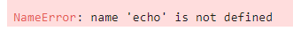

- 이 경우 \_\_init\_\_.py 에 \_\_all\_\_ 로 정의해야 가능하다.


```python
with open('pkg/sound/__init__.py', 'r') as f:
    print(f.read())
    f.close()
```

    __all__ = ['echo']


### relative 패키지

<table>
<thead>
<tr>
<th>접근자</th>
<th>설명</th>
</tr>
</thead>
<tbody>
<tr>
<td><code>..</code></td>
<td>부모 디렉터리</td>
</tr>
<tr>
<td><code>.</code></td>
<td>현재 디렉터리</td>
</tr>
</tbody>
</table>


```python
with open('pkg/graphic/render.py', 'w') as f:
    data = '''from ..sound.echo import echo_test
def render_test():
    print("Oh! grphic Master~!")
    echo_test()'''
    f.write(data)
```


```python
from pkg.graphic.render import render_test
render_test()
```

    Initializing game ...
    Oh! grphic Master~!
    echo


## 예외 처리

### 오류 발생
- 오타
- 존재하지 않는 파일 사용
- 수학적 오류
- 인덱스 오류

### 오류 예외 처리 기법
#### try-except 문

**오류를 처리하기 위한 try-except 문의 기본 구조**
<blockquote><pre>
try:
    ...
except [발생오류 [as 오류변수]]:
    ...
</pre>
</blockquote>

#### try-finally문

**오류를 처리하기 위한 try-finally 문의 기본 구조**
<blockquote><pre>
--- try_finally.py
try:
    f = open('foo.txt', 'w # ex...')
    -- 무언가를 수행한다.

    (... 생략 ...)

finally:
    f.close()  -- 중간에 오류가 발생하더라도 무조건 실행된다.
</pre>
</blockquote>


#### 여러개의 오류 처리하기
**try문 안에서 여러 개의 오류를 처리**

<blockquote><pre>
try:
    ...
except 발생오류1:
   ... 
except 발생오류2:
   ...
 ...
</pre>
</blockquote>

#### try-else 문에는 다음처럼 else 절을 사용할 수도 있다.

**try 문에는 다음처럼 else 절을 사용할 수도 있다.**

<blockquote><pre>
try:
    ...
except [발생오류 [as 오류변수]]:
    ...

    else:  -- 오류가 없을 경우에만 수행
    ...
</pre>
</blockquote>

### 오류 일부러 발생시키기

#### try-except 문


```python
# 일반적 에러
4/0
# ZeroDivisionError: division by zero
```


    ---------------------------------------------------------------------------

    ZeroDivisionError                         Traceback (most recent call last)

    Cell In[5], line 2
          1 # 일반적 에러
    ----> 2 4/0
          3 # ZeroDivisionError: division by zero


    ZeroDivisionError: division by zero


```python
# try-except (모든 에러 발생시)
try:
    4/0
except:
    a=1
    b=2
    print(a+b)
    print('error;;')
```

    3
    error;;


```python
# try-except2 (발생 오류만 포함한 except 문)
try:
    print('must be quit..')
    4/0
    for i in 3:
        pass
except ZeroDivisionError:
    print('error;;')
```

    must be quit..
    error;;


```python
# try-except2 (발생 오류만 포함한 except 문)
try:
    4/0
    for i in 3:
        pass
except ZeroDivisionError as e:
    print(e)
```

    division by zero


#### try-finally문


```python
# try-finally 구문 (무조건 실행)
try:
    f = open('foo.txt', 'w')
    # 무언가 수행함.
    # for i in 3:
    #     f.write(i)
    4/0
finally:
    print('emergency file close;;')
    f.close()
```

    emergency file close;;


    ---------------------------------------------------------------------------

    ZeroDivisionError                         Traceback (most recent call last)

    Cell In[18], line 7
          3     f = open('foo.txt', 'w')
          4     # 무언가 수행함.
          5     # for i in 3:
          6     #     f.write(i)
    ----> 7     4/0
          8 finally:
          9     print('emergency file close;;')


    ZeroDivisionError: division by zero


#### 여러 개의 오류 처리하기.


```python
# try-except 여러개 1 (먼저발생에러만 표현)
try:
    a = [1,2]
    print(a[3])
    4/0
except ZeroDivisionError as j:
    print(j)
except IndexError as e:
    print(e)
```

    list index out of range


```python
# try-except 여러개 2 (먼저발생에러만 표현)
try:
    a = [1,2]
    print(a[3])
    4/0
except (ZeroDivisionError, IndexError) as e:
    print(e)
```

    list index out of range


#### try-else 문


```python
# try_else.py (오류가 없을 때 else가 실행)
try:
    age=int(input('나이를 입력하세요: '))
except:
    print('입력이 정확하지 않습니다.')
else:
    if age <= 18:
        print('미성년자는 출입금지입니다.')
    else:
        print('환영합니다.')
```

    나이를 입력하세요:  8


    미성년자는 출입금지입니다.


### 오류 회피하기


```python
# error_pass.py
try:
    f = open("나없는파일", 'r')
except FileNotFoundError:
    pass
```

### 오류 일부러 발생시키기. (raise) *


```python
class Bird:
    def fly(self):
        raise NotImplementedError
```


```python
class Eagle(Bird):
    # pass
    def fly(self):
        print("very fast")
eagle = Eagle()
eagle.fly()
```

    very fast


### 예외 만들기 *


```python
class MyError(Exception):
    pass
```


```python
def say_nick(nick):
    if 'fool' == nick:
        raise MyError()
    print(nick)
```


```python
say_nick('enjoy')
say_nick('fool')
```

    enjoy


    ---------------------------------------------------------------------------

    MyError                                   Traceback (most recent call last)

    Cell In[29], line 2
          1 say_nick('enjoy')
    ----> 2 say_nick('fool')


    Cell In[28], line 3, in say_nick(nick)
          1 def say_nick(nick):
          2     if 'fool' == nick:
    ----> 3         raise MyError()
          4     print(nick)


    MyError: 


```python
try:
    say_nick('enjoy')
    say_nick('fool')
except MyError as e:
    print('must not allow nick..', e)
```

    enjoy
    must not allow nick.. 


```python
class MyError(Exception):
    def __str__(self):
        return "must not allow nick.."
```


```python
try:
    say_nick('enjoy')
    say_nick('fool')
except MyError as e:
    print(e)
```

    enjoy
    must not allow nick..


## 내장함수 *
- 알아두면 좋을 기능들만..

### all ( 모두가 참 )


```python
all([1,2,3,0,5,6])
```


    False


### any (하나라도 참이면 참..)


```python
any([1,2,3,0,5,6,7])
```


    True


### chr (유니코드 입력받아 해당 문자리턴) **


```python
chr(65)
```


    'A'


```python
chr(54038)
```


    '팖'


```python
for i in range(65, 91):
    if( 90 == i ): 
        print(chr(i))
    else:
        print(chr(i), end=',')
```

    A,B,C,D,E,F,G,H,I,J,K,L,M,N,O,P,Q,R,S,T,U,V,W,X,Y,Z


```python
def dn(text): # ord - chr의 반대로.. 숫자로 변환.
    print(chr(ord(text) + 32))
```


```python
dn('A')
```

    a


```python
def upp(text): # ord - chr의 반대로.. 숫자로 변환.
    print(chr(ord(text) - 32))
```


```python
upp('h')
```

    H


### dir (객체가 지닌 변수나 함수를 보여준다.)


```python
dir([])
```

### enumerate
- 값과 인덱스 동시에 나오게 하는 의외로...


```python
for i, v in enumerate(['a', 'b', 'c']):
    print(i, v)
```

    0 a
    1 b
    2 c


```python
arr = ['a', 'b', 'c']
for (v, i) in zip(arr, range(len(arr))):
    print(v, i)
```

    a 0
    b 1
    c 2


### filter (리턴값이 참인 것만 리턴한다.)


```python
# 사용 전
def positive(l):
    result=[]
    for i in l:
        if 0 < i:
            result.append(i)
    return result
print(positive([1, -3, 2, 0, -5, 6]))
```

    [1, 2, 6]


```python
# 사용 후
def positive(x):
    return 0 < x

print(list(filter(positive, [1, -3, 2, 0, -5, 6])))
```

    [1, 2, 6]


```python
# lamda 사용
print(list(filter(lambda x: 0 < x, [1, -3, 2, 0, -5, 6])))
```

    [1, 2, 6]


### map ( 요소에 함수 f를 적용한 결과를 리턴하는 함수)


```python
# 사용 전
def two_times(numlist):
    result = []
    for num in numlist:
        result.append(num * 2)
    return result
result = two_times([1, 2, 3, 4])
print(result)
```

    [2, 4, 6, 8]


```python
# 사용 후
def two_times(x): return x * 2
list(map(two_times, [1, 2, 3, 4]))
```


    [2, 4, 6, 8]


```python
# lambda 사용
list(map(lambda x: x * 2, [1, 2, 3, 4]))
```


    [2, 4, 6, 8]


### round ( 반올림 )


```python
round(3.14)
```


    3


```python
round(3.14, 1)
```


    3.1


### sorted ( 입력 데이터를 정렬한 후 그 결과를 리스트로 리턴 )


```python
sorted([1, 4, 6, 7, 8, 100, -30, ])
```


    [-30, 1, 4, 6, 7, 8, 100]


```python
sorted([1, 4, 6, 7, 8, 100, -30, ], reverse = True)
```


    [100, 8, 7, 6, 4, 1, -30]


## 표준 라이브러리

### datetime.date


```python
import datetime
day2 = datetime.date(2023, 9, 20)
day1 = datetime.date(2024, 1, 22)

print(day1)
print(day)

diff = day1 - day2
print(diff.days)
```

    2024-01-22
    2024-01-22
    124


### time **

#### time.time


```python
import time as t
t.time()
```


    1705894240.7529593


```python
t.localtime(t.time())
```


    time.struct_time(tm_year=2024, tm_mon=1, tm_mday=22, tm_hour=12, tm_min=30, tm_sec=49, tm_wday=0, tm_yday=22, tm_isdst=0)


```python
t.ctime()
```


    'Mon Jan 22 12:31:11 2024'


```python
t.sleep
```


    <function time.sleep>


```python
for i in range(10):
    print(i)
    t.sleep(0.5)
```

    0
    1
    2
    3
    4
    5
    6
    7
    8
    9


### random (규칙이 없는 임의의 수)


```python
import random as rd
import time as t
```


```python
dice = [0] * 6
start = t.time()
while 2000000 > i:
    ran = rd.randint(1, 6)
    dice[ran - 1] += 1
    i += 1
print('Let\'s view dice count.')
for i, v in enumerate(dice):
    print(f'{i + 1} : {v}')

print(f'counted time : {round(t.time() - start, 3)}s' )
```

    Let's view dice count.
    1 : 333117
    2 : 333088
    3 : 333461
    4 : 333884
    5 : 332735
    6 : 333710
    counted time : 4.116s


```python
# 위 예시에서 가중치 적용하면.. (아래 예시는 1, 3에 가중치 20% 첨가)
dice = [0] * 6
start = t.time()
while 2000000 > i:
    ran = rd.choices(range(1, 7), weights = [0.3, 0.1, 0.3, 0.1, 0.1, 0.1])
    dice[ran[0] - 1] += 1
    i += 1
print('Let\'s view dice count.')
for i, v in enumerate(dice):
    print(f'{i + 1} : {v}')

print(f'counted time : {round(t.time() - start, 3)}s' )
```

    Let's view dice count.
    1 : 600428
    2 : 199758
    3 : 600068
    4 : 199380
    5 : 199757
    6 : 200604
    counted time : 14.905s


- 아래부터 가이드
    - @ : 추후 아니면 선택..
    - @* or ** : 지금은 아니라도 반드시체크해봐야..
    - * or ** : 당장 확인.

### itertools.permutation, itertools.combination (수학적 확률)@*

### functools.reduce @*

### operator.itemgetter @*

### shutil (파일을 복사하거나 이동) **

### glob *

### pickle @*

### OS **

### zipfile @

### threading @**

### tempfile @

### traceback @

### JSON **

### urllib @*

### webbrowser @
