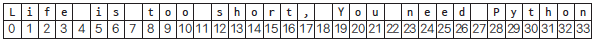
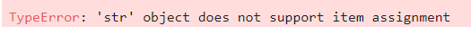
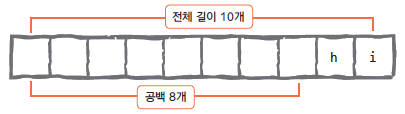
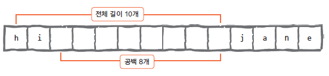
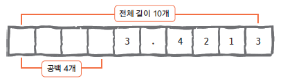

```python
# 사전 import
import math
```

<div style="font-size: 2rem"> ML 문법</div>
<hr/>

[점프 투 파이썬]("https://wikidocs.net/book/1")   
<span style="color:orange; font-size:1.5rem;"><strong>강조</strong></span>  

# [주피터랩 단축키]
- a : 위 셀 집어넣기
- b : 아래 셀 집어넣기
- Ctrl +Shift + 위 : 셀 위로 이동
- Ctrl +Shift + 아래 : 셀 아래로 이동
- Shift + Enter : 셀 실행하며 아래 셀 생성
- Ctrl + Enter : 그냥 셀 실행.
- D 두번 : 셀 삭제. (실수 방지 목적으로 2번)
- x : 셀 잘라내기
- c : 셀 복사
- v : 셀 붙여넣기
- z : undo
- Shift + z : redo
- m : ML
- y : code

# 기초, 자료형 p45

## 숫자형

### 정수형


```python
a = 123
b = -123
c = 0
```


```python
print( a, b, c )
```

    123 -123 0


### 실수형


```python
aa = 1.23
bb = -3.1415
cc = 3.14e10
```


```python
print(aa, bb)
```

    1.23 -3.1415


### 8진수, 16진수 *
    8진수 0o17, 16진수 0x17


```python
a = 0o17
b = 0x17
print(a, b)
```

    15 23


### 숫자형을 활용하기 위한 연산자

#### 사칙연산


```python
a = 1234
b = 5678
print( a+b )
print( a-b )
print( a*b )
print( a/b )
print( a/3 )
print( a//3 )
print( a%3 )
print( a**2, b**3 )
```

    6912
    -4444
    7006652
    0.2173300457907714
    411.3333333333333
    411
    1
    1522756 183056925752


## 문자열 자료형 p50

### 문자열 만드는 법

#### 큰따옴표 양쪽 둘러싸기


```python
"Hello World~"
```


    'Hello World~'


#### 작은따옴표 양쪽 둘러싸기


```python
'wow~!'
```


    'wow~!'


#### 큰따옴표 3개 연속으로 쓰기


```python
"""
    Hello World~
    Nice too meet you~
"""
```


    '\n    Hello World~\n    Nice too meet you~\n'


#### 작은따옴표 3개를 연속으로 쓰기


```python
'''
    Thanks very much.
    Oh~! Nice Friend~
'''
```


    '\n    Thanks very much.\n    Oh~! Nice Friend~\n'


### 문자열 안에 작은 따옴표 or 큰 따옴표

#### 문자열에 작은따옴표 포함하기


```python
say = "He say 'Hello' so said."
print(say)
```

    He say 'Hello' so said.


#### 문자열에 큰따옴표 포함하기


```python
say = 'He say "Hello" so said.'
print(say)
```

    He say "Hello" so said.


#### 역슬래시로 이스케이프 문자 표현.


```python
say = "He say \"Hello\" so said."
print(say)
```

    He say "Hello" so said.


### 여러 줄인 문자열을 변수에 대입하고 싶을 때 (생략)

### 문자열 연산

#### 문자열 더하기


```python
a = 'Python is '
b = 'fun~'
print( a + b )
```

    Python is fun~


#### 문자열 곱하기


```python
aa = 'I\'m hungry!! '
print( aa * 3 )
```

    I'm hungry!! I'm hungry!! I'm hungry!! 


#### 문자열 곱하기(응용)


```python
print('=' * 50)
print('My Program'.center(50))
print('=' * 50)
```

    ==================================================
                        My Program                    
    ==================================================


- '문자열'.center(...) 로 중앙정렬 가능 추후 자세한 설명기회를..

#### 문자열 길이 구하기 *


```python
a = "Life is too short"
len(a)
```


    17


### 문자열 인덱싱, 슬라이싱 p56 **
#### 문자열 인덱싱

a = "Life is too short, You need Python"





```python
a = "Life is too short, You need Python"
```


```python
a[3]
```


    'e'


#### 문자열 인덱싱 활용하기
- 중요한 사항은 바로 아래에


```python
a1 = a[-3]
a2 = a[-1]
print( a1 + a2 )
```

    hn


```python
arr = [ a[0], a[12], a[-1] ]
```


```python
print( arr )
```

    ['L', 's', 'n']


```python
arr = [ a[-0], a[-2], a[-5] ]
```


```python
print( arr )
```

    ['L', 'o', 'y']


#### 문자열 슬라이싱


```python
a = "Life is too short, You need Python"
# b = a[0] + a[1] + a[2] + a[3] <<--- 귀찮...
b = a[0:4] # 이렇게 가능
print(b)
```

    Life


```python
b = a[-6:] # js의 for (let i=-6; i < 0; i++)
print(b)
```

    Python


#### 문자열을 슬라이싱 하는 방법


```python
a = "Life is too short, You need Python"
print(a[5:7])
print(a[19:])
print(a[:17])
print(a[:])
print(a[19:-7])
```

    is
    You need Python
    Life is too short
    Life is too short, You need Python
    You need


#### 슬라이싱으로 문자열나누기 (생략)

#### 슬라이싱과 대입 *


```python
a = "Pithon"
# a[1:2] = 'y' # 문자열은 낱개로 변경불가능한 자료형.
t = a[0] + 'y' + a[2:]
print( a, '>>', t )
```

    Pithon >> Python


<span style="color: orange; font-size: 1.2rem;">문자열은 낱개로 변경불가능한 자료형.</span>  


### 문자열 포메팅
  
<table style="float:left; font-size: 1.2rem;">
    <thead>
        <tr>
            <th>코드</th>
            <th>설명</th>
        </tr>
    </thead>
    <tbody>
        <tr>
            <td>%s</td>
            <td>문자열(String)</td>
        </tr>
        <tr>
            <td>%c</td>
            <td>문자 1개(character)</td>
        </tr>
        <tr>
            <td>%d</td>
            <td>정수(Integer)</td>
        </tr>
        <tr>
            <td>%f</td>
            <td>부동소수(floating-point)</td>
        </tr>
        <tr>
            <td>%o</td>
            <td>8진수</td>
        </tr>
        <tr>
            <td>%x</td>
            <td>16진수</td>
        </tr>
        <tr>
            <td>%%</td>
            <td>Literal % (문자 '%' 자체)</td>
        </tr>
    </tbody>
</table>

#### 숫자 바로 대입


```python
# import math << 반드시 집어넣기. 위에서 넣어서 생략.

print("I eat %d apples." % 3)
print("I eat %s apples." % "five")
print("%d >> octal >> %o, 1234 >> Hex >> %x" %(1234, 1234, 1234) )
print("%%f는 %f처럼 소숫점을 담을 수 있는데, 단순히 %%s는 %.8s처럼 문자열로 바꾸어 대입하기에 복잡하게 생각안해도 된다." %(math.pi, math.pi))
```

    I eat 3 apples.
    I eat five apples.
    1234 >> octal >> 2322, 1234 >> Hex >> 4d2
    %f는 3.141593처럼 소숫점을 담을 수 있는데, 단순히 %s는 3.141592처럼 문자열로 바꾸어 대입하기에 복잡하게 생각안해도 된다.


- '%.8s' 같은 정렬 및 표현에 관해서는 다음 코너에..

### 포맷코드와 숫자 함께 사용하기

#### 정렬과 공백
오른쪽 정렬

  

왼쪽 정렬




```python
print("%10s" % "hi")
```

            hi


```python
print("%-10sjane" % "hi")
```

    hi        jane


#### 소수점 표현하기




```python
# import math

print("%0.4f" %math.pi)
print("%10.4fmath pi" %math.pi)
print("%-10.4fpi" %math.pi)
```

    3.1416
        3.1416math pi
    3.1416    pi

